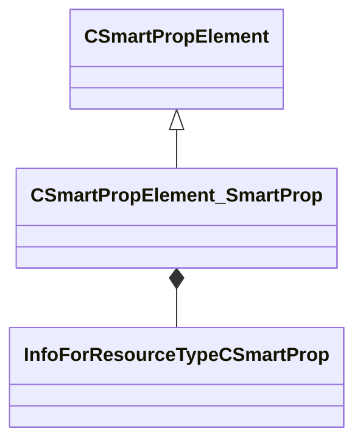

[Schemas](../../schemas.md) / [smartprops](../smartprops.md) / CSmartPropElement_SmartProp

# CSmartPropElement_SmartProp

> Source: **Build 25000182** · 2026-08-28 · `windows-x86_64` · schema `0.10.0`

**Kind:** class · **Size:** 368 bytes (`0x170`) · **Align:** 8 · **Module:** smartprops

**Inherits from:** [CSmartPropElement](../smartprops/CSmartPropElement.md)

**Metadata:** `MPropertyDescription Evaluates a specified smart prop as a child of the current element.`, `MPropertyFriendlyName Smart Prop Reference`, `MVDataOutlinerAssetNameExpr`

**Relationships:**

## Memory layout

7 fields (2 declared here, 5 inherited). Offsets are absolute from the object base.

| Offset | Field | Type | From | Annotations |
|--------|-------|------|------|-------------|
| `0x8` | `m_nElementID` | int32 | [CSmartPropElement](../smartprops/CSmartPropElement.md) | `MPropertySuppressField` `MVDataUniqueMonotonicInt _editor/next_element_id` |
| `0x10` | `m_bEnabled` | CSmartPropAttributeBool | [CSmartPropElement](../smartprops/CSmartPropElement.md) | `MPropertyDescription Is this element enabled? If not enabled, this element will not be evaluted and will have no effect on the result.` `MPropertySortPriority 10` `MVDataEnableKey` |
| `0x50` | `m_sLabel` | CUtlString | [CSmartPropElement](../smartprops/CSmartPropElement.md) | `MPropertyDescription Optional text that will appear in the outliner to help organize Smart Prop elements and communicate their purpose to other users.` `MPropertyFriendlyName Label` |
| `0x58` | `m_SelectionCriteria` | CUtlVector< [CSmartPropSelectionCriteria](../smartprops/CSmartPropSelectionCriteria.md)* > | [CSmartPropElement](../smartprops/CSmartPropElement.md) | `MPropertyFriendlyName Selection Criteria` `MVDataPromoteField 2` |
| `0x70` | `m_Modifiers` | CUtlVector< [CSmartPropModifier](../smartprops/CSmartPropModifier.md)* > | [CSmartPropElement](../smartprops/CSmartPropElement.md) | `MPropertyFriendlyName Modifiers` `MVDataPromoteField 2` |
| `0x88` | `m_sSmartProp` | CResourceNameTyped< CWeakHandle< [InfoForResourceTypeCSmartProp](../resourcesystem/InfoForResourceTypeCSmartProp.md) > > |  | `MPropertyDescription Name of the target smart prop resource (.vsmart) to evaluate.` |
| `0x168` | `m_bLocalEvaluationState` | bool |  | `MPropertyDescription If enabled, any changes made to the evaluation state by the target smart prop (as well as modifiers) will only apply locally and will not affect the evaluation state of the parent. Disabling this will allow modifications to the evaluation state by the referenced smart prop to apply the current state of the of the parent. For example if the referenced smart prop applies a transform and you want the transform to affect the elements in the parent after this element, then you should disable local evaluation state.` |

KV3 class defaults

<pre>{
	&quot;_class&quot;: &quot;CSmartPropElement_SmartProp&quot;,
	&quot;m_nElementID&quot;: -1,
	&quot;m_bEnabled&quot;: true,
	&quot;m_sLabel&quot;: &quot;&quot;,
	&quot;m_SelectionCriteria&quot;:
	[
	],
	&quot;m_Modifiers&quot;:
	[
	],
	&quot;m_sSmartProp&quot;: &quot;&quot;,
	&quot;m_bLocalEvaluationState&quot;: true
}</pre>

