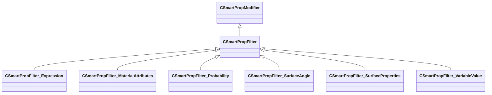

[Schemas](../../schemas.md) / [smartprops](../smartprops.md) / CSmartPropFilter

# CSmartPropFilter

> Source: **Build 25000182** · 2026-08-28 · `windows-x86_64` · schema `0.10.0`

**Kind:** class · **Size:** 80 bytes (`0x50`) · **Align:** n/a (unspecified) · **Module:** smartprops

**Inherits from:** [CSmartPropModifier](../smartprops/CSmartPropModifier.md)

**Derived by:** [CSmartPropFilter_Expression](../smartprops/CSmartPropFilter_Expression.md), [CSmartPropFilter_MaterialAttributes](../smartprops/CSmartPropFilter_MaterialAttributes.md), [CSmartPropFilter_Probability](../smartprops/CSmartPropFilter_Probability.md), [CSmartPropFilter_SurfaceAngle](../smartprops/CSmartPropFilter_SurfaceAngle.md), [CSmartPropFilter_SurfaceProperties](../smartprops/CSmartPropFilter_SurfaceProperties.md), [CSmartPropFilter_VariableValue](../smartprops/CSmartPropFilter_VariableValue.md)

**Metadata:** `MVDataNodeTintColor`

**Relationships:**

## Memory layout

1 field (0 declared here, 1 inherited). Offsets are absolute from the object base.

| Offset | Field | Type | From | Annotations |
|--------|-------|------|------|-------------|
| `0x8` | `m_bEnabled` | CSmartPropAttributeBool | [CSmartPropModifier](../smartprops/CSmartPropModifier.md) | `MVDataEnableKey` |
