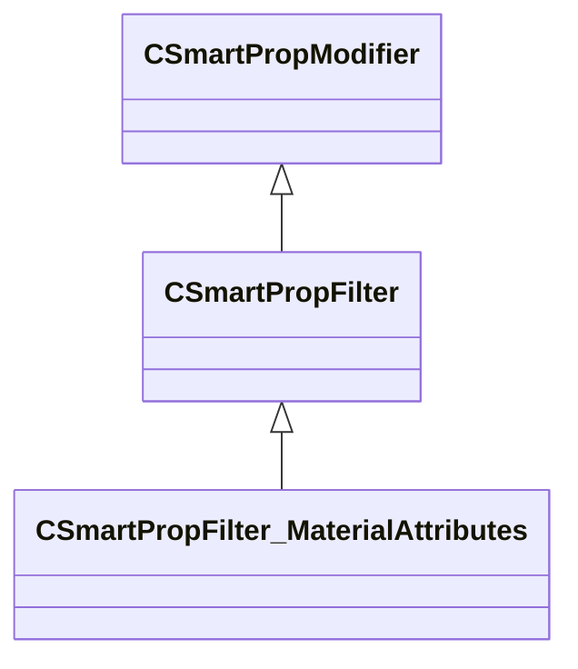

[Schemas](../../schemas.md) / [smartprops](../smartprops.md) / CSmartPropFilter_MaterialAttributes

# CSmartPropFilter_MaterialAttributes

**Kind:** class · **Size:** 128 bytes (`0x80`) · **Align:** 8 · **Module:** smartprops

**Inherits from:** [CSmartPropFilter](../smartprops/CSmartPropFilter.md)

**Metadata:** `MPropertyDescription Allows the parent element to be conditionally evaluated based on attributes assigned to the surface material.`, `MPropertyFriendlyName Filter: Material Attributes`, `MVDataClassGroup Filter`

**Relationships:**

## Memory layout

3 fields (2 declared here, 1 inherited). Offsets are absolute from the object base.

| Offset | Field | Type | From | Annotations |
|--------|-------|------|------|-------------|
| `0x8` | `m_bEnabled` | CSmartPropAttributeBool | [CSmartPropModifier](../smartprops/CSmartPropModifier.md) | `MVDataEnableKey` |
| `0x50` | `m_AllowedMaterialAttributes` | CUtlVector< CUtlString > |  | `MPropertyDescription List of material attributes on which this element is valid. If empty, the element is not restricted to any specific surfaces.` |
| `0x68` | `m_DisallowedMaterialAttributes` | CUtlVector< CUtlString > |  | `MPropertyDescription List of material attributes on which this element is not valid. If empty, the element is not restricted to any specific surfaces.` |

KV3 class defaults

<pre>{
	&quot;_class&quot;: &quot;CSmartPropFilter_MaterialAttributes&quot;,
	&quot;m_bEnabled&quot;: true,
	&quot;m_AllowedMaterialAttributes&quot;:
	[
	],
	&quot;m_DisallowedMaterialAttributes&quot;:
	[
	]
}</pre>

