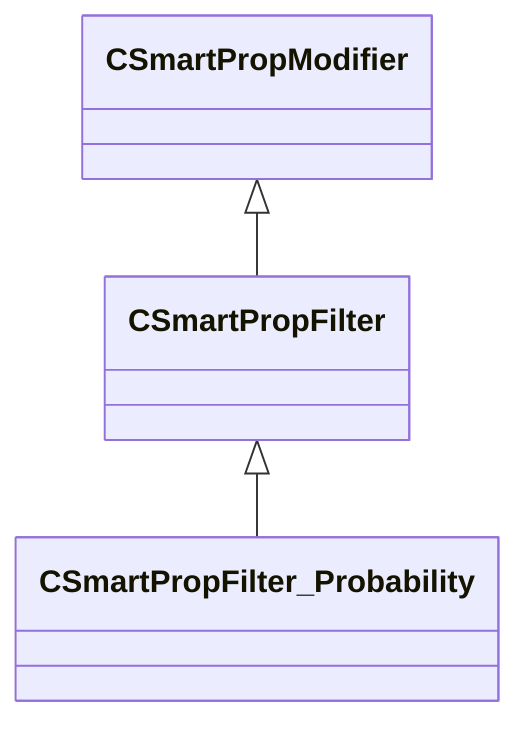

[Schemas](../../schemas.md) / [smartprops](../smartprops.md) / CSmartPropFilter_Probability

# CSmartPropFilter_Probability

> Source: **Build 25000182** · 2026-08-28 · `windows-x86_64` · schema `0.10.0`

**Kind:** class · **Size:** 144 bytes (`0x90`) · **Align:** 8 · **Module:** smartprops

**Inherits from:** [CSmartPropFilter](../smartprops/CSmartPropFilter.md)

**Metadata:** `MPropertyDescription Causes the parent element to only be evaluated with a specified random probability.`, `MPropertyFriendlyName Filter: Probability`, `MVDataClassGroup Filter`

**Relationships:**

## Memory layout

2 fields (1 declared here, 1 inherited). Offsets are absolute from the object base.

| Offset | Field | Type | From | Annotations |
|--------|-------|------|------|-------------|
| `0x8` | `m_bEnabled` | CSmartPropAttributeBool | [CSmartPropModifier](../smartprops/CSmartPropModifier.md) | `MVDataEnableKey` |
| `0x50` | `m_flProbability` | CSmartPropAttributeFloat |  | `MPropertyDescription 0.0 to 1.0 value indicating the probability of this element being evaluated. Where a value of 0 means the element will never be evaluated and 1.0 means it will always be evaluated` |

KV3 class defaults

<pre>{
	&quot;_class&quot;: &quot;CSmartPropFilter_Probability&quot;,
	&quot;m_bEnabled&quot;: true,
	&quot;m_flProbability&quot;: 0.500000
}</pre>

