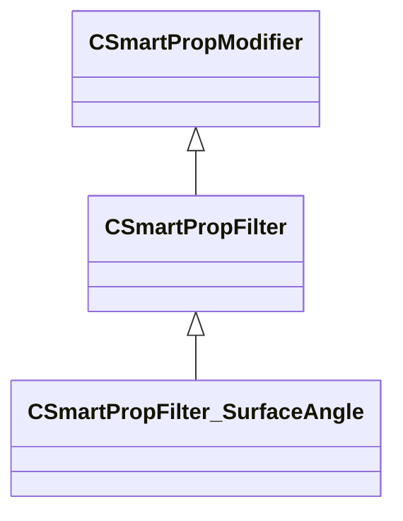

[Schemas](../../schemas.md) / [smartprops](../smartprops.md) / CSmartPropFilter_SurfaceAngle

# CSmartPropFilter_SurfaceAngle

> Source: **Build 25000182** · 2026-08-28 · `windows-x86_64` · schema `0.10.0`

**Kind:** class · **Size:** 208 bytes (`0xd0`) · **Align:** 8 · **Module:** smartprops

**Inherits from:** [CSmartPropFilter](../smartprops/CSmartPropFilter.md)

**Metadata:** `MPropertyDescription Allows the parent element to be conditionally evaluated base on the current surface angle. The surface angle is set based on the initial placement of the smart prop object, but can also be updated by the Trace to Surface modifier.`, `MPropertyFriendlyName Filter: Surface Angles`, `MVDataClassGroup Filter`

**Relationships:**

## Memory layout

3 fields (2 declared here, 1 inherited). Offsets are absolute from the object base.

| Offset | Field | Type | From | Annotations |
|--------|-------|------|------|-------------|
| `0x8` | `m_bEnabled` | CSmartPropAttributeBool | [CSmartPropModifier](../smartprops/CSmartPropModifier.md) | `MVDataEnableKey` |
| `0x50` | `m_flSurfaceSlopeMin` | CSmartPropAttributeFloat |  | `MPropertyDescription Minimum slope on which the target will be placed. Slope is a [ 0, 180 ] value of the surface normal rotation from up such that 0 is a horizontal surface (floor), 90 is a vertical surface (wall), 180 is horizontal upside down surface (ceiling).` |
| `0x90` | `m_flSurfaceSlopeMax` | CSmartPropAttributeFloat |  | `MPropertyDescription Maximum slope on which the target will be placed.` |

KV3 class defaults

<pre>{
	&quot;_class&quot;: &quot;CSmartPropFilter_SurfaceAngle&quot;,
	&quot;m_bEnabled&quot;: true,
	&quot;m_flSurfaceSlopeMin&quot;: 0.000000,
	&quot;m_flSurfaceSlopeMax&quot;: 180.000000
}</pre>

