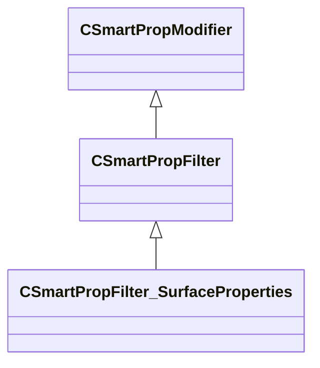

[Schemas](../../schemas.md) / [smartprops](../smartprops.md) / CSmartPropFilter_SurfaceProperties

# CSmartPropFilter_SurfaceProperties

> Source: **Build 25000182** · 2026-08-28 · `windows-x86_64` · schema `0.10.0`

**Kind:** class · **Size:** 128 bytes (`0x80`) · **Align:** 8 · **Module:** smartprops

**Inherits from:** [CSmartPropFilter](../smartprops/CSmartPropFilter.md)

**Metadata:** `MPropertyDescription Allows the parent element to be conditionally evaluated based on surface properties.`, `MPropertyFriendlyName Filter: Surface Properties`, `MVDataClassGroup Filter`

**Relationships:**

## Memory layout

3 fields (2 declared here, 1 inherited). Offsets are absolute from the object base.

| Offset | Field | Type | From | Annotations |
|--------|-------|------|------|-------------|
| `0x8` | `m_bEnabled` | CSmartPropAttributeBool | [CSmartPropModifier](../smartprops/CSmartPropModifier.md) | `MVDataEnableKey` |
| `0x50` | `m_AllowedSurfaceProperties` | CUtlVector< CUtlString > |  | `MPropertyDescription List of surface properties on which this element is valid. If empty element is not restricted to any specific surfaces.` |
| `0x68` | `m_DisallowedSurfaceProperties` | CUtlVector< CUtlString > |  | `MPropertyDescription List of surface properties on which this element is not valid. If empty element is not restricted to any specific surfaces.` |

KV3 class defaults

<pre>{
	&quot;_class&quot;: &quot;CSmartPropFilter_SurfaceProperties&quot;,
	&quot;m_bEnabled&quot;: true,
	&quot;m_AllowedSurfaceProperties&quot;:
	[
	],
	&quot;m_DisallowedSurfaceProperties&quot;:
	[
	]
}</pre>

