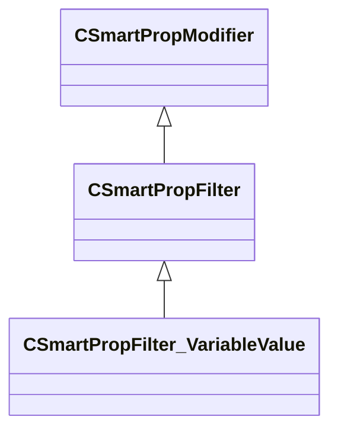

[Schemas](../../schemas.md) / [smartprops](../smartprops.md) / CSmartPropFilter_VariableValue

# CSmartPropFilter_VariableValue

**Kind:** class · **Size:** 112 bytes (`0x70`) · **Align:** 8 · **Module:** smartprops

**Inherits from:** [CSmartPropFilter](../smartprops/CSmartPropFilter.md)

**Metadata:** `MPropertyDescription Compares the current value of a variable to the specified value. If the comparison is false the element evaluation is stopped.`, `MPropertyFriendlyName Filter: Variable Value`, `MVDataClassGroup Filter`

**Relationships:**

## Memory layout

2 fields (1 declared here, 1 inherited). Offsets are absolute from the object base.

| Offset | Field | Type | From | Annotations |
|--------|-------|------|------|-------------|
| `0x8` | `m_bEnabled` | CSmartPropAttributeBool | [CSmartPropModifier](../smartprops/CSmartPropModifier.md) | `MVDataEnableKey` |
| `0x50` | `m_VariableComparison` | CSmartPropVariableComparison |  |  |

KV3 class defaults

<pre>{
	&quot;_class&quot;: &quot;CSmartPropFilter_VariableValue&quot;,
	&quot;m_bEnabled&quot;: true,
	&quot;m_VariableComparison&quot;:
	{
		&quot;m_Name&quot;: &quot;&quot;,
		&quot;m_Value&quot;: null,
		&quot;m_Comparison&quot;: &quot;EQUAL&quot;
	}
}</pre>

