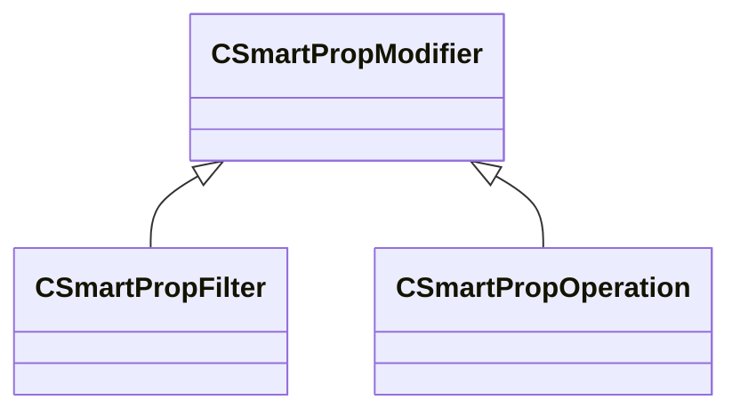

[Schemas](../../schemas.md) / [smartprops](../smartprops.md) / CSmartPropModifier

# CSmartPropModifier

**Kind:** class · **Size:** 80 bytes (`0x50`) · **Align:** 255 · **Module:** smartprops

**Derived by:** [CSmartPropFilter](../smartprops/CSmartPropFilter.md), [CSmartPropOperation](../smartprops/CSmartPropOperation.md)

**Metadata:** `MVDataAnonymousNode`, `MVDataBase`, `MVDataNodeType 1`

**Relationships:**

## Memory layout

1 fields (1 declared here, 0 inherited). Offsets are absolute from the object base.

| Offset | Field | Type | From | Annotations |
|--------|-------|------|------|-------------|
| `0x8` | `m_bEnabled` | CSmartPropAttributeBool |  | `MVDataEnableKey` |
