[Schemas](../../schemas.md) / [smartprops](../smartprops.md) / CSmartPropOperation

# CSmartPropOperation

> Source: **Build 25000182** · 2026-08-28 · `windows-x86_64` · schema `0.10.0`

**Kind:** class · **Size:** 80 bytes (`0x50`) · **Align:** n/a (unspecified) · **Module:** smartprops

**Inherits from:** [CSmartPropModifier](../smartprops/CSmartPropModifier.md)

**Derived by:** [CSmartPropOperation_ComputeCrossProduct3D](../smartprops/CSmartPropOperation_ComputeCrossProduct3D.md), [CSmartPropOperation_ComputeDistance3D](../smartprops/CSmartPropOperation_ComputeDistance3D.md), [CSmartPropOperation_ComputeDotProduct3D](../smartprops/CSmartPropOperation_ComputeDotProduct3D.md), [CSmartPropOperation_ComputeNormalizedVector3D](../smartprops/CSmartPropOperation_ComputeNormalizedVector3D.md), [CSmartPropOperation_ComputeProjectVector3D](../smartprops/CSmartPropOperation_ComputeProjectVector3D.md), [CSmartPropOperation_ComputeVectorBetweenPoints3D](../smartprops/CSmartPropOperation_ComputeVectorBetweenPoints3D.md), [CSmartPropOperation_MaterialOverride](../smartprops/CSmartPropOperation_MaterialOverride.md), [CSmartPropOperation_MaterialTint](../smartprops/CSmartPropOperation_MaterialTint.md), [CSmartPropOperation_RandomColorTintColor](../smartprops/CSmartPropOperation_RandomColorTintColor.md), [CSmartPropOperation_RestoreState](../smartprops/CSmartPropOperation_RestoreState.md), [CSmartPropOperation_SaveColor](../smartprops/CSmartPropOperation_SaveColor.md), [CSmartPropOperation_SaveDirection](../smartprops/CSmartPropOperation_SaveDirection.md), [CSmartPropOperation_SavePosition](../smartprops/CSmartPropOperation_SavePosition.md), [CSmartPropOperation_SaveScale](../smartprops/CSmartPropOperation_SaveScale.md), [CSmartPropOperation_SaveState](../smartprops/CSmartPropOperation_SaveState.md), [CSmartPropOperation_SaveSurfaceNormal](../smartprops/CSmartPropOperation_SaveSurfaceNormal.md), [CSmartPropOperation_SetMateraialGroupChoice](../smartprops/CSmartPropOperation_SetMateraialGroupChoice.md), [CSmartPropOperation_SetTintColor](../smartprops/CSmartPropOperation_SetTintColor.md), [CSmartPropOperation_SetVariable](../smartprops/CSmartPropOperation_SetVariable.md), [CSmartPropTransformOperation](../smartprops/CSmartPropTransformOperation.md)

**Relationships:**

```mermaid
classDiagram
    CSmartPropModifier <|-- CSmartPropOperation
    CSmartPropOperation <|-- CSmartPropOperation_ComputeCrossProduct3D
    CSmartPropOperation <|-- CSmartPropOperation_ComputeDistance3D
    CSmartPropOperation <|-- CSmartPropOperation_ComputeDotProduct3D
    CSmartPropOperation <|-- CSmartPropOperation_ComputeNormalizedVector3D
    CSmartPropOperation <|-- CSmartPropOperation_ComputeProjectVector3D
    CSmartPropOperation <|-- CSmartPropOperation_ComputeVectorBetweenPoints3D
    CSmartPropOperation <|-- CSmartPropOperation_MaterialOverride
    CSmartPropOperation <|-- CSmartPropOperation_MaterialTint
    CSmartPropOperation <|-- CSmartPropOperation_RandomColorTintColor
    CSmartPropOperation <|-- CSmartPropOperation_RestoreState
    CSmartPropOperation <|-- CSmartPropOperation_SaveColor
    CSmartPropOperation <|-- CSmartPropOperation_SaveDirection
    CSmartPropOperation <|-- CSmartPropOperation_SavePosition
    CSmartPropOperation <|-- CSmartPropOperation_SaveScale
    CSmartPropOperation <|-- CSmartPropOperation_SaveState
    CSmartPropOperation <|-- CSmartPropOperation_SaveSurfaceNormal
    CSmartPropOperation <|-- CSmartPropOperation_SetMateraialGroupChoice
    CSmartPropOperation <|-- CSmartPropOperation_SetTintColor
    CSmartPropOperation <|-- CSmartPropOperation_SetVariable
    CSmartPropOperation <|-- CSmartPropTransformOperation
```

## Memory layout

1 field (0 declared here, 1 inherited). Offsets are absolute from the object base.

| Offset | Field | Type | From | Annotations |
|--------|-------|------|------|-------------|
| `0x8` | `m_bEnabled` | CSmartPropAttributeBool | [CSmartPropModifier](../smartprops/CSmartPropModifier.md) | `MVDataEnableKey` |
