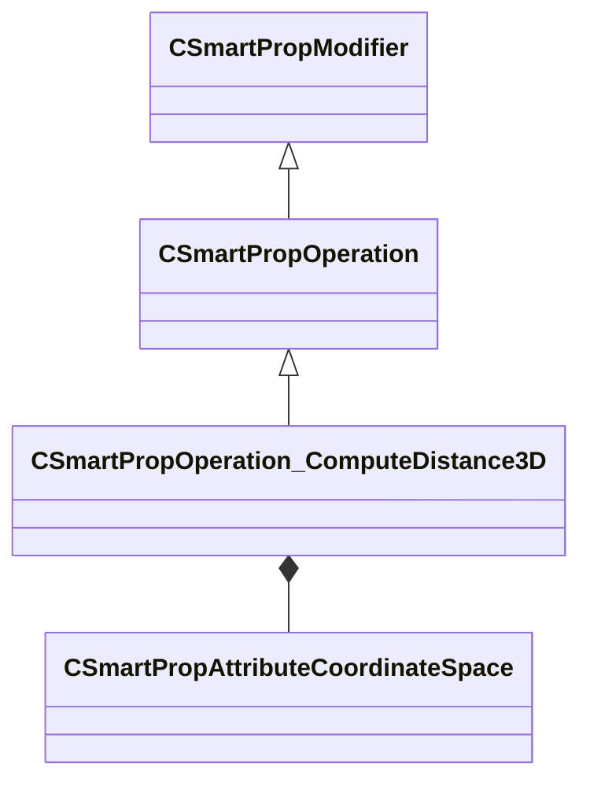

[Schemas](../../schemas.md) / [smartprops](../smartprops.md) / CSmartPropOperation_ComputeDistance3D

# CSmartPropOperation_ComputeDistance3D

> Source: **Build 25000182** · 2026-08-28 · `windows-x86_64` · schema `0.10.0`

**Kind:** class · **Size:** 408 bytes (`0x198`) · **Align:** 8 · **Module:** smartprops

**Inherits from:** [CSmartPropOperation](../smartprops/CSmartPropOperation.md)

**Metadata:** `MPropertyDescription Compute the distance between two 3D points`, `MPropertyFriendlyName Distance`, `MVDataClassGroup Compute`

**Relationships:**

## Memory layout

7 fields (6 declared here, 1 inherited). Offsets are absolute from the object base.

| Offset | Field | Type | From | Annotations |
|--------|-------|------|------|-------------|
| `0x8` | `m_bEnabled` | CSmartPropAttributeBool | [CSmartPropModifier](../smartprops/CSmartPropModifier.md) | `MVDataEnableKey` |
| `0x50` | `m_OutputVariableName` | CUtlString |  | `MPropertyAttributeEditor SmartPropItemNameEditor( Variable:Float )` `MPropertyFriendlyName Output Variable` |
| `0x58` | `m_OutputCoordinateSpace` | [CSmartPropAttributeCoordinateSpace](../smartprops/CSmartPropAttributeCoordinateSpace.md) |  | `MPropertyDescription Specifies the coordinate space the distance should be computed in. The scale of the coordinate space may affect the distance value.` |
| `0x98` | `m_InputPositionA` | CSmartPropAttributeVector |  | `MPropertyFriendlyName Position A` `MPropertyGroupName +Position A` |
| `0xd8` | `m_CoordinateSpaceA` | [CSmartPropAttributeCoordinateSpace](../smartprops/CSmartPropAttributeCoordinateSpace.md) |  | `MPropertyDescription Specifies the coordinate space of position A.` `MPropertyGroupName +Position A` |
| `0x118` | `m_InputPositionB` | CSmartPropAttributeVector |  | `MPropertyFriendlyName Position B` `MPropertyGroupName +Position B` |
| `0x158` | `m_CoordinateSpaceB` | [CSmartPropAttributeCoordinateSpace](../smartprops/CSmartPropAttributeCoordinateSpace.md) |  | `MPropertyDescription Specifies the coordinate space of position B.` `MPropertyGroupName +Position B` |

KV3 class defaults

<pre>{
	&quot;_class&quot;: &quot;CSmartPropOperation_ComputeDistance3D&quot;,
	&quot;m_bEnabled&quot;: true,
	&quot;m_OutputVariableName&quot;: &quot;&quot;,
	&quot;m_OutputCoordinateSpace&quot;: &quot;WORLD&quot;,
	&quot;m_InputPositionA&quot;:
	[
		0.000000,
		0.000000,
		0.000000
	],
	&quot;m_CoordinateSpaceA&quot;: &quot;WORLD&quot;,
	&quot;m_InputPositionB&quot;:
	[
		0.000000,
		0.000000,
		0.000000
	],
	&quot;m_CoordinateSpaceB&quot;: &quot;WORLD&quot;
}</pre>

