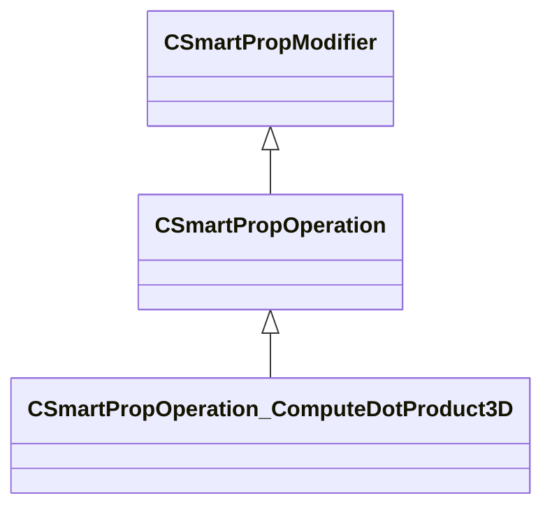

[Schemas](../../schemas.md) / [smartprops](../smartprops.md) / CSmartPropOperation_ComputeDotProduct3D

# CSmartPropOperation_ComputeDotProduct3D

> Source: **Build 25000182** · 2026-08-28 · `windows-x86_64` · schema `0.10.0`

**Kind:** class · **Size:** 216 bytes (`0xd8`) · **Align:** 8 · **Module:** smartprops

**Inherits from:** [CSmartPropOperation](../smartprops/CSmartPropOperation.md)

**Metadata:** `MPropertyDescription Compute a dot or cross product between two 3D vectors`, `MPropertyFriendlyName Dot Product`, `MVDataClassGroup Compute`

**Relationships:**

## Memory layout

4 fields (3 declared here, 1 inherited). Offsets are absolute from the object base.

| Offset | Field | Type | From | Annotations |
|--------|-------|------|------|-------------|
| `0x8` | `m_bEnabled` | CSmartPropAttributeBool | [CSmartPropModifier](../smartprops/CSmartPropModifier.md) | `MVDataEnableKey` |
| `0x50` | `m_OutputVariableName` | CUtlString |  | `MPropertyAttributeEditor SmartPropItemNameEditor( Variable:Float )` `MPropertyFriendlyName Output Variable` |
| `0x58` | `m_InputVectorA` | CSmartPropAttributeVector |  | `MPropertyFriendlyName Vector A` |
| `0x98` | `m_InputVectorB` | CSmartPropAttributeVector |  | `MPropertyFriendlyName Vector B` |

KV3 class defaults

<pre>{
	&quot;_class&quot;: &quot;CSmartPropOperation_ComputeDotProduct3D&quot;,
	&quot;m_bEnabled&quot;: true,
	&quot;m_OutputVariableName&quot;: &quot;&quot;,
	&quot;m_InputVectorA&quot;:
	[
		0.000000,
		0.000000,
		0.000000
	],
	&quot;m_InputVectorB&quot;:
	[
		0.000000,
		0.000000,
		0.000000
	]
}</pre>

