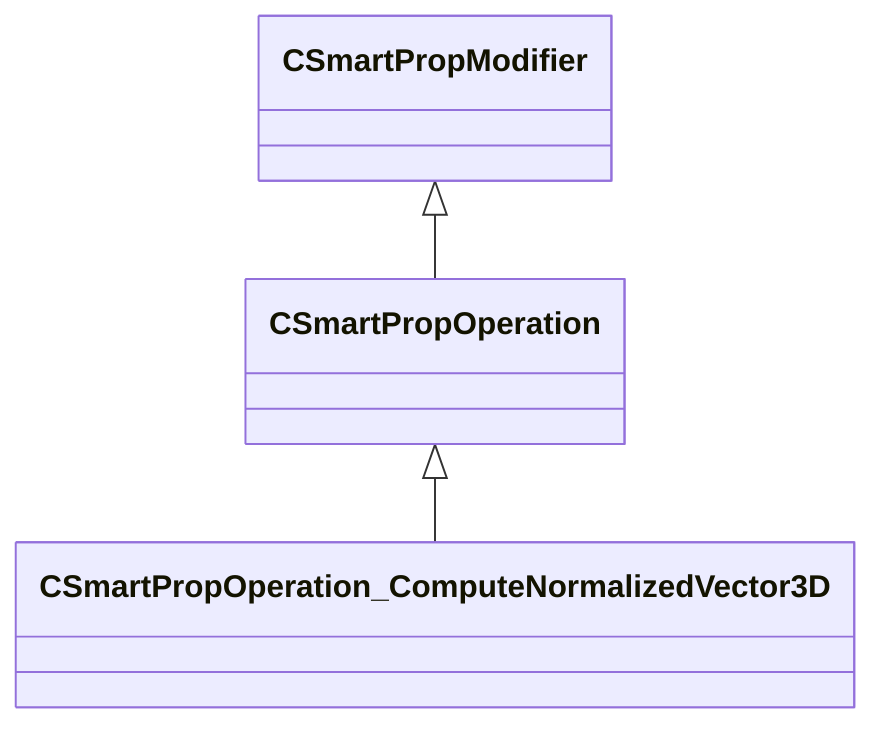

[Schemas](../../schemas.md) / [smartprops](../smartprops.md) / CSmartPropOperation_ComputeNormalizedVector3D

# CSmartPropOperation_ComputeNormalizedVector3D

> Source: **Build 25000182** · 2026-08-28 · `windows-x86_64` · schema `0.10.0`

**Kind:** class · **Size:** 152 bytes (`0x98`) · **Align:** 8 · **Module:** smartprops

**Inherits from:** [CSmartPropOperation](../smartprops/CSmartPropOperation.md)

**Metadata:** `MPropertyDescription Normalize the value of a 3d vector.`, `MPropertyFriendlyName Normalize Vector`, `MVDataClassGroup Compute`

**Relationships:**

## Memory layout

3 fields (2 declared here, 1 inherited). Offsets are absolute from the object base.

| Offset | Field | Type | From | Annotations |
|--------|-------|------|------|-------------|
| `0x8` | `m_bEnabled` | CSmartPropAttributeBool | [CSmartPropModifier](../smartprops/CSmartPropModifier.md) | `MVDataEnableKey` |
| `0x50` | `m_OutputVariableName` | CUtlString |  | `MPropertyAttributeEditor SmartPropItemNameEditor( Variable:Vector3 )` `MPropertyFriendlyName Output Variable` |
| `0x58` | `m_InputVector` | CSmartPropAttributeVector |  |  |

KV3 class defaults

<pre>{
	&quot;_class&quot;: &quot;CSmartPropOperation_ComputeNormalizedVector3D&quot;,
	&quot;m_bEnabled&quot;: true,
	&quot;m_OutputVariableName&quot;: &quot;&quot;,
	&quot;m_InputVector&quot;:
	[
		0.000000,
		0.000000,
		0.000000
	]
}</pre>

