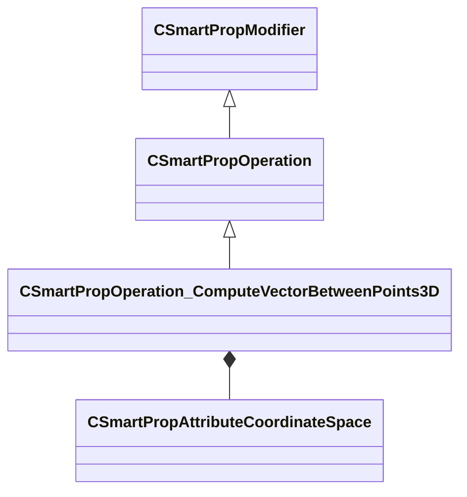

[Schemas](../../schemas.md) / [smartprops](../smartprops.md) / CSmartPropOperation_ComputeVectorBetweenPoints3D

# CSmartPropOperation_ComputeVectorBetweenPoints3D

> Source: **Build 25000182** · 2026-08-28 · `windows-x86_64` · schema `0.10.0`

**Kind:** class · **Size:** 472 bytes (`0x1d8`) · **Align:** 8 · **Module:** smartprops

**Inherits from:** [CSmartPropOperation](../smartprops/CSmartPropOperation.md)

**Metadata:** `MPropertyDescription Compute the vector between two 3D points`, `MPropertyFriendlyName Vector Between Points`, `MVDataClassGroup Compute`

**Relationships:**

## Memory layout

8 fields (7 declared here, 1 inherited). Offsets are absolute from the object base.

| Offset | Field | Type | From | Annotations |
|--------|-------|------|------|-------------|
| `0x8` | `m_bEnabled` | CSmartPropAttributeBool | [CSmartPropModifier](../smartprops/CSmartPropModifier.md) | `MVDataEnableKey` |
| `0x50` | `m_OutputVariableName` | CUtlString |  | `MPropertyAttributeEditor SmartPropItemNameEditor( Variable:Vector3 )` `MPropertyFriendlyName Output Variable` |
| `0x58` | `m_OutputCoordinateSpace` | [CSmartPropAttributeCoordinateSpace](../smartprops/CSmartPropAttributeCoordinateSpace.md) |  | `MPropertyDescription Specifies the coordinate space that vector should be returned in.` |
| `0x98` | `m_bNormalized` | CSmartPropAttributeBool |  | `MPropertyDescription Should the return value be normalized to unit length (direction vector).` `MPropertyFriendlyName Normalized (Direction Vector)` |
| `0xd8` | `m_InputPositionA` | CSmartPropAttributeVector |  | `MPropertyFriendlyName Position A` `MPropertyGroupName +Position A` |
| `0x118` | `m_CoordinateSpaceA` | [CSmartPropAttributeCoordinateSpace](../smartprops/CSmartPropAttributeCoordinateSpace.md) |  | `MPropertyDescription Specifies the coordinate space of position A.` `MPropertyGroupName +Position A` |
| `0x158` | `m_InputPositionB` | CSmartPropAttributeVector |  | `MPropertyFriendlyName Position B` `MPropertyGroupName +Position B` |
| `0x198` | `m_CoordinateSpaceB` | [CSmartPropAttributeCoordinateSpace](../smartprops/CSmartPropAttributeCoordinateSpace.md) |  | `MPropertyDescription Specifies the coordinate space of position B.` `MPropertyGroupName +Position B` |

KV3 class defaults

<pre>{
	&quot;_class&quot;: &quot;CSmartPropOperation_ComputeVectorBetweenPoints3D&quot;,
	&quot;m_bEnabled&quot;: true,
	&quot;m_OutputVariableName&quot;: &quot;&quot;,
	&quot;m_OutputCoordinateSpace&quot;: &quot;WORLD&quot;,
	&quot;m_bNormalized&quot;: false,
	&quot;m_InputPositionA&quot;:
	[
		0.000000,
		0.000000,
		0.000000
	],
	&quot;m_CoordinateSpaceA&quot;: &quot;WORLD&quot;,
	&quot;m_InputPositionB&quot;:
	[
		0.000000,
		0.000000,
		0.000000
	],
	&quot;m_CoordinateSpaceB&quot;: &quot;WORLD&quot;
}</pre>

