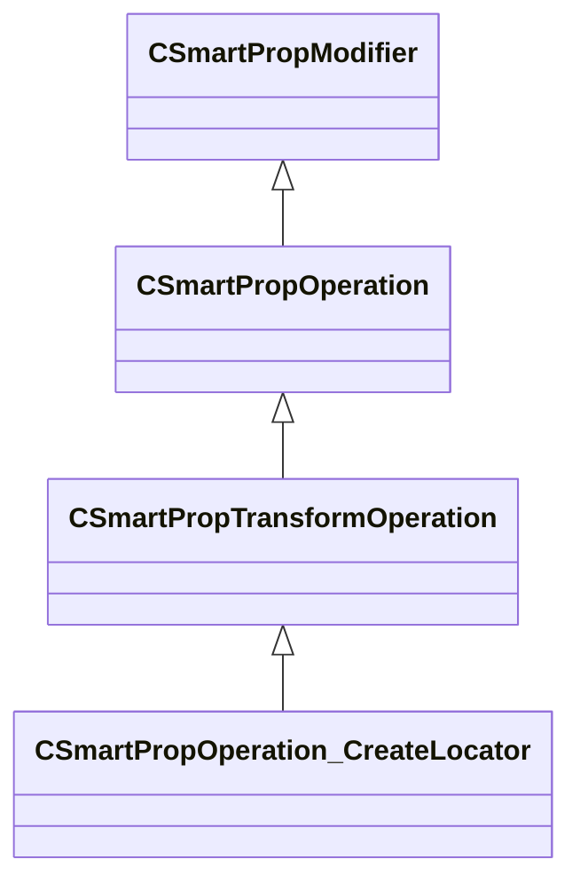

[Schemas](../../schemas.md) / [smartprops](../smartprops.md) / CSmartPropOperation_CreateLocator

# CSmartPropOperation_CreateLocator

> Source: **Build 25000182** · 2026-08-28 · `windows-x86_64` · schema `0.10.0`

**Kind:** class · **Size:** 472 bytes (`0x1d8`) · **Align:** 8 · **Module:** smartprops

**Inherits from:** [CSmartPropTransformOperation](../smartprops/CSmartPropTransformOperation.md)

**Metadata:** `MPropertyDescription Create a locator with the current transform. The locator may optionally be configurable, so that its transform can be modified in Hammer.`, `MPropertyFriendlyName Create Locator`, `MVDataClassGroup Manipulators`

**Relationships:**

## Memory layout

8 fields (7 declared here, 1 inherited). Offsets are absolute from the object base.

| Offset | Field | Type | From | Annotations |
|--------|-------|------|------|-------------|
| `0x8` | `m_bEnabled` | CSmartPropAttributeBool | [CSmartPropModifier](../smartprops/CSmartPropModifier.md) | `MVDataEnableKey` |
| `0x50` | `m_LocatorName` | CUtlString |  | `MPropertyAttributeEditor SmartPropItemNameEditor( Locator )` `MPropertyDescription Name of the locator. This can be used to reference the locator in this element or its children. If the locator is configurable, the locator will be identified by this name in Hammer.` `MPropertyFriendlyName Name` |
| `0x58` | `m_vOffset` | CSmartPropAttributeVector |  | `MPropertyDescription Offset of the locator relative to the current transform. This allows the locator to be created at an offset location without applying that offset to the current transform.` |
| `0x98` | `m_flDisplayScale` | CSmartPropAttributeFloat |  | `MPropertyDescription Scale to apply only to the locator model` |
| `0xd8` | `m_bConfigurable` | CSmartPropAttributeBool |  | `MPropertyDescription Controls whether or not the locator can be edited in a smart prop configuration. If enabled an editable locator will appear when the smart prop is placed in Hammer. Any changes to that locator will modify the current transform.` |
| `0x118` | `m_bAllowTranslation` | CSmartPropAttributeBool |  | `MPropertyGroupName Configuration` `MPropertyReadonlyExpr m_bConfigurable == false` |
| `0x158` | `m_bAllowRotation` | CSmartPropAttributeBool |  | `MPropertyGroupName Configuration` `MPropertyReadonlyExpr m_bConfigurable == false` |
| `0x198` | `m_bAllowScale` | CSmartPropAttributeBool |  | `MPropertyDescription Controls whether or not the configuration of the locator can include scale. If enabled scale can be applied to the editable locator in Hammer. If disabled the scale will not be editable and the current scale will be used.` `MPropertyGroupName Configuration` `MPropertyReadonlyExpr m_bConfigurable == false` |

KV3 class defaults

<pre>{
	&quot;_class&quot;: &quot;CSmartPropOperation_CreateLocator&quot;,
	&quot;m_bEnabled&quot;: true,
	&quot;m_LocatorName&quot;: &quot;&quot;,
	&quot;m_vOffset&quot;:
	[
		0.000000,
		0.000000,
		0.000000
	],
	&quot;m_flDisplayScale&quot;: 1.000000,
	&quot;m_bConfigurable&quot;: true,
	&quot;m_bAllowTranslation&quot;: true,
	&quot;m_bAllowRotation&quot;: true,
	&quot;m_bAllowScale&quot;: false
}</pre>

