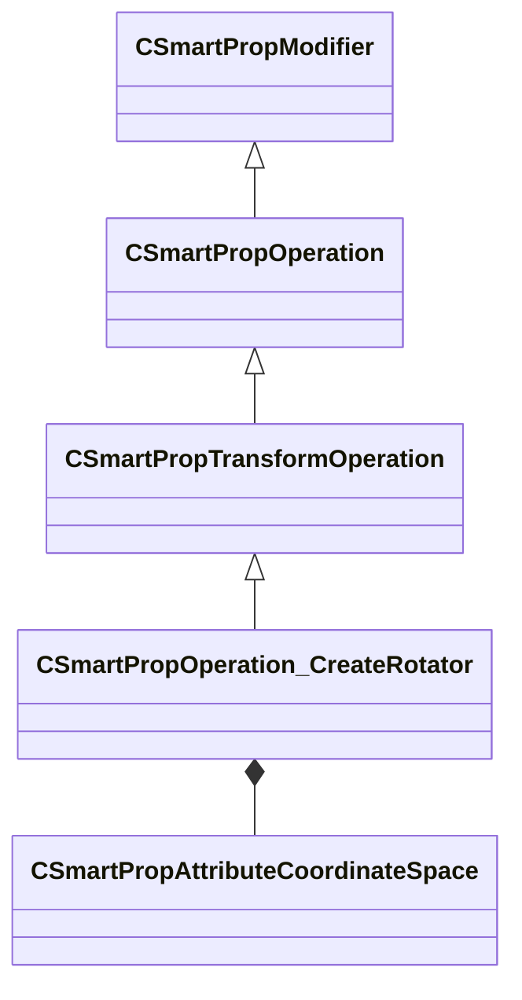

[Schemas](../../schemas.md) / [smartprops](../smartprops.md) / CSmartPropOperation_CreateRotator

# CSmartPropOperation_CreateRotator

> Source: **Build 25000182** · 2026-08-28 · `windows-x86_64` · schema `0.10.0`

**Kind:** class · **Size:** 800 bytes (`0x320`) · **Align:** 8 · **Module:** smartprops

**Inherits from:** [CSmartPropTransformOperation](../smartprops/CSmartPropTransformOperation.md)

**Metadata:** `MPropertyDescription Create a rotator that will be displayed at the current location, allowing the user to manipulate a rotation around an axis. The rotation value can be applied to the current transform as well as saved to a variable.`, `MPropertyFriendlyName Create Rotator`, `MVDataClassGroup Manipulators`

**Relationships:**

## Memory layout

14 fields (13 declared here, 1 inherited). Offsets are absolute from the object base.

| Offset | Field | Type | From | Annotations |
|--------|-------|------|------|-------------|
| `0x8` | `m_bEnabled` | CSmartPropAttributeBool | [CSmartPropModifier](../smartprops/CSmartPropModifier.md) | `MVDataEnableKey` |
| `0x50` | `m_Name` | CUtlString |  | `MPropertyDescription Name used to identify the rotator. Must be unique within the parent element.` `MPropertyFriendlyName Name` |
| `0x58` | `m_vOffset` | CSmartPropAttributeVector |  | `MPropertyDescription Offset of the rotator relative to the current transform. This allows the rotator to be created at an offset location without applying that offset to the current transform.` |
| `0x98` | `m_vRotationAxis` | CSmartPropAttributeVector |  | `MPropertyDescription Axis around which the rotation will occur` |
| `0xd8` | `m_CoordinateSpace` | [CSmartPropAttributeCoordinateSpace](../smartprops/CSmartPropAttributeCoordinateSpace.md) |  | `MPropertyDescription Coordinate space the axis of rotation is specified in.` |
| `0x118` | `m_flDisplayRadius` | CSmartPropAttributeFloat |  | `MPropertyDescription Radius at which the rotator handle should be displayed.` |
| `0x158` | `m_DisplayColor` | CSmartPropAttributeColor |  | `MPropertyDescription Color to display the rotator handle with.` |
| `0x198` | `m_bApplyToCurrentTransform` | CSmartPropAttributeBool |  | `MPropertyDescription Should the rotation be applied to the current transform.` |
| `0x1d8` | `m_flSnappingIncrement` | CSmartPropAttributeFloat |  | `MPropertyDescription Specifies the number of degrees the rotation should snap to. If set to 0, then the rotation snapping will be controlled by the rotation snapping in Hammer.` |
| `0x218` | `m_flInitialAngle` | CSmartPropAttributeFloat |  | `MPropertyDescription Specifies the angle the rotator should be set to initially.` |
| `0x258` | `m_bEnforceLimits` | CSmartPropAttributeBool |  | `MPropertyDescription If enabled, the minimum and maximum rotation angles will be used to limit the range of the rotation.` `MPropertyFriendlyName Enforce Limits` |
| `0x298` | `m_flMinAngle` | CSmartPropAttributeFloat |  | `MPropertyDescription Specifies the minimum angle limit in degrees` `MPropertyFriendlyName Minimum Angle` `MPropertyReadonlyExpr m_bEnforceLimits == false` |
| `0x2d8` | `m_flMaxAngle` | CSmartPropAttributeFloat |  | `MPropertyDescription Specifies the minimum angle limit in degrees` `MPropertyFriendlyName Maximum Angle` `MPropertyReadonlyExpr m_bEnforceLimits == false` |
| `0x318` | `m_OutputVariable` | CUtlString |  | `MPropertyAttributeEditor SmartPropItemNameEditor( Variable:Float )` `MPropertyDescription Specifies a float variable to which the rotation value should be output. The variable only receives the rotation around the axis, the axis of rotation does not affect this output.` |

KV3 class defaults

<pre>{
	&quot;_class&quot;: &quot;CSmartPropOperation_CreateRotator&quot;,
	&quot;m_bEnabled&quot;: true,
	&quot;m_Name&quot;: &quot;&quot;,
	&quot;m_vOffset&quot;:
	[
		0.000000,
		0.000000,
		0.000000
	],
	&quot;m_vRotationAxis&quot;:
	[
		0.000000,
		0.000000,
		1.000000
	],
	&quot;m_CoordinateSpace&quot;: &quot;ELEMENT&quot;,
	&quot;m_flDisplayRadius&quot;: 16.000000,
	&quot;m_DisplayColor&quot;:
	[
		170,
		170,
		110
	],
	&quot;m_bApplyToCurrentTransform&quot;: true,
	&quot;m_flSnappingIncrement&quot;: 0.000000,
	&quot;m_flInitialAngle&quot;: 0.000000,
	&quot;m_bEnforceLimits&quot;: false,
	&quot;m_flMinAngle&quot;: 0.000000,
	&quot;m_flMaxAngle&quot;: 0.000000,
	&quot;m_OutputVariable&quot;: &quot;&quot;
}</pre>

