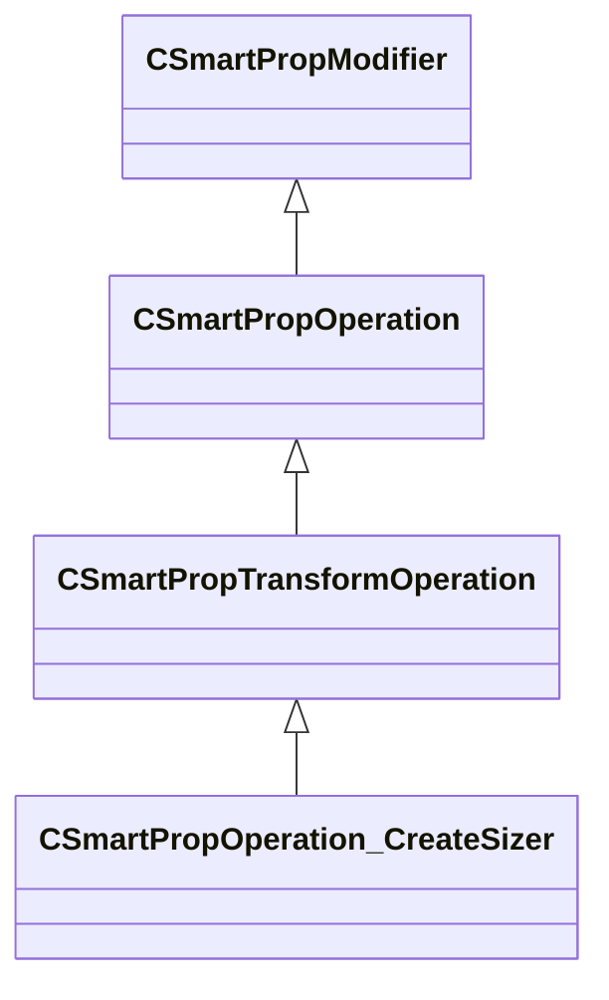

[Schemas](../../schemas.md) / [smartprops](../smartprops.md) / CSmartPropOperation_CreateSizer

# CSmartPropOperation_CreateSizer

> Source: **Build 25000182** · 2026-08-28 · `windows-x86_64` · schema `0.10.0`

**Kind:** class · **Size:** 968 bytes (`0x3c8`) · **Align:** 8 · **Module:** smartprops

**Inherits from:** [CSmartPropTransformOperation](../smartprops/CSmartPropTransformOperation.md)

**Metadata:** `MPropertyDescription Create a sizer that will be displayed at the current location, allowing the user to manipulate the specified set of size values.`, `MPropertyFriendlyName Create Sizer`, `MVDataClassGroup Manipulators`

**Relationships:**

## Memory layout

21 fields (20 declared here, 1 inherited). Offsets are absolute from the object base.

| Offset | Field | Type | From | Annotations |
|--------|-------|------|------|-------------|
| `0x8` | `m_bEnabled` | CSmartPropAttributeBool | [CSmartPropModifier](../smartprops/CSmartPropModifier.md) | `MVDataEnableKey` |
| `0x50` | `m_Name` | CUtlString |  | `MPropertyDescription Name used to identify the sizer. Must be unique within the paraent element.` `MPropertyFriendlyName Name` |
| `0x58` | `m_bDisplayModel` | CSmartPropAttributeBool |  | `MPropertyDescription If enabled a model will be displayed at the position of the sizer that can be used to select the sizer in Hammer.` `MPropertyFriendlyName Display Model` |
| `0x98` | `m_flInitialMinX` | CSmartPropAttributeFloat |  | `MPropertyGroupName X-Axis Size` |
| `0xd8` | `m_flInitialMaxX` | CSmartPropAttributeFloat |  | `MPropertyGroupName X-Axis Size` |
| `0x118` | `m_flConstraintMinX` | CSmartPropAttributeFloat |  | `MPropertyGroupName X-Axis Size` |
| `0x158` | `m_flConstraintMaxX` | CSmartPropAttributeFloat |  | `MPropertyGroupName X-Axis Size` |
| `0x198` | `m_OutputVariableMinX` | CUtlString |  | `MPropertyAttributeEditor SmartPropItemNameEditor( Variable:Float )` `MPropertyGroupName X-Axis Size` |
| `0x1a0` | `m_OutputVariableMaxX` | CUtlString |  | `MPropertyAttributeEditor SmartPropItemNameEditor( Variable:Float )` `MPropertyGroupName X-Axis Size` |
| `0x1a8` | `m_flInitialMinY` | CSmartPropAttributeFloat |  | `MPropertyGroupName Y-Axis Size` |
| `0x1e8` | `m_flInitialMaxY` | CSmartPropAttributeFloat |  | `MPropertyGroupName Y-Axis Size` |
| `0x228` | `m_flConstraintMinY` | CSmartPropAttributeFloat |  | `MPropertyGroupName Y-Axis Size` |
| `0x268` | `m_flConstraintMaxY` | CSmartPropAttributeFloat |  | `MPropertyGroupName Y-Axis Size` |
| `0x2a8` | `m_OutputVariableMinY` | CUtlString |  | `MPropertyAttributeEditor SmartPropItemNameEditor( Variable:Float )` `MPropertyGroupName Y-Axis Size` |
| `0x2b0` | `m_OutputVariableMaxY` | CUtlString |  | `MPropertyAttributeEditor SmartPropItemNameEditor( Variable:Float )` `MPropertyGroupName Y-Axis Size` |
| `0x2b8` | `m_flInitialMinZ` | CSmartPropAttributeFloat |  | `MPropertyGroupName Z-Axis Size` |
| `0x2f8` | `m_flInitialMaxZ` | CSmartPropAttributeFloat |  | `MPropertyGroupName Z-Axis Size` |
| `0x338` | `m_flConstraintMinZ` | CSmartPropAttributeFloat |  | `MPropertyGroupName Z-Axis Size` |
| `0x378` | `m_flConstraintMaxZ` | CSmartPropAttributeFloat |  | `MPropertyGroupName Z-Axis Size` |
| `0x3b8` | `m_OutputVariableMinZ` | CUtlString |  | `MPropertyAttributeEditor SmartPropItemNameEditor( Variable:Float )` `MPropertyGroupName Z-Axis Size` |
| `0x3c0` | `m_OutputVariableMaxZ` | CUtlString |  | `MPropertyAttributeEditor SmartPropItemNameEditor( Variable:Float )` `MPropertyGroupName Z-Axis Size` |

KV3 class defaults

<pre>{
	&quot;_class&quot;: &quot;CSmartPropOperation_CreateSizer&quot;,
	&quot;m_bEnabled&quot;: true,
	&quot;m_Name&quot;: &quot;&quot;,
	&quot;m_bDisplayModel&quot;: false,
	&quot;m_flInitialMinX&quot;: 0.000000,
	&quot;m_flInitialMaxX&quot;: 0.000000,
	&quot;m_flConstraintMinX&quot;: 0.000000,
	&quot;m_flConstraintMaxX&quot;: 0.000000,
	&quot;m_OutputVariableMinX&quot;: &quot;&quot;,
	&quot;m_OutputVariableMaxX&quot;: &quot;&quot;,
	&quot;m_flInitialMinY&quot;: 0.000000,
	&quot;m_flInitialMaxY&quot;: 0.000000,
	&quot;m_flConstraintMinY&quot;: 0.000000,
	&quot;m_flConstraintMaxY&quot;: 0.000000,
	&quot;m_OutputVariableMinY&quot;: &quot;&quot;,
	&quot;m_OutputVariableMaxY&quot;: &quot;&quot;,
	&quot;m_flInitialMinZ&quot;: 0.000000,
	&quot;m_flInitialMaxZ&quot;: 0.000000,
	&quot;m_flConstraintMinZ&quot;: 0.000000,
	&quot;m_flConstraintMaxZ&quot;: 0.000000,
	&quot;m_OutputVariableMinZ&quot;: &quot;&quot;,
	&quot;m_OutputVariableMaxZ&quot;: &quot;&quot;
}</pre>

