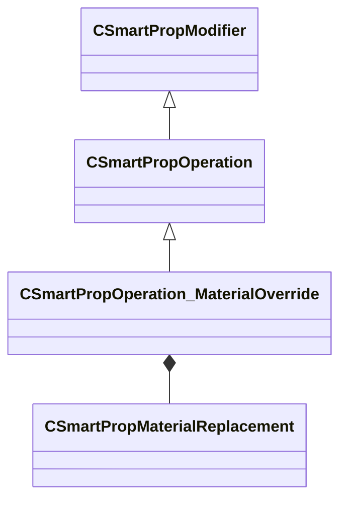

[Schemas](../../schemas.md) / [smartprops](../smartprops.md) / CSmartPropOperation_MaterialOverride

# CSmartPropOperation_MaterialOverride

> Source: **Build 25000182** · 2026-08-28 · `windows-x86_64` · schema `0.10.0`

**Kind:** class · **Size:** 168 bytes (`0xa8`) · **Align:** 8 · **Module:** smartprops

**Inherits from:** [CSmartPropOperation](../smartprops/CSmartPropOperation.md)

**Metadata:** `MPropertyDescription Specifies a table of material replacements to apply to all following models. Mapping goes from the material specified by the model (including material group selection) to the replacement material. Previous material overrides are not considered when determining the base material.`, `MPropertyFriendlyName Material Override`, `MVDataClassGroup Material`

**Relationships:**

## Memory layout

3 fields (2 declared here, 1 inherited). Offsets are absolute from the object base.

| Offset | Field | Type | From | Annotations |
|--------|-------|------|------|-------------|
| `0x8` | `m_bEnabled` | CSmartPropAttributeBool | [CSmartPropModifier](../smartprops/CSmartPropModifier.md) | `MVDataEnableKey` |
| `0x50` | `m_bClearCurrentOverrides` | CSmartPropAttributeBool |  | `MPropertyDescription If enabled, clear any previous material overrides, so that only the material replacements specified in this table will be active.` `MPropertyFriendlyName Clear Active Overrides` |
| `0x90` | `m_MaterialReplacements` | CUtlVector< [CSmartPropMaterialReplacement](../smartprops/CSmartPropMaterialReplacement.md) > |  | `MPropertyAutoExpandSelf` `MPropertyDescription Table specifying pairs of existing materials and the material to replace them with.` `MPropertyFriendlyName Material Replacements` |

KV3 class defaults

<pre>{
	&quot;_class&quot;: &quot;CSmartPropOperation_MaterialOverride&quot;,
	&quot;m_bEnabled&quot;: true,
	&quot;m_bClearCurrentOverrides&quot;: false,
	&quot;m_MaterialReplacements&quot;:
	[
	]
}</pre>

