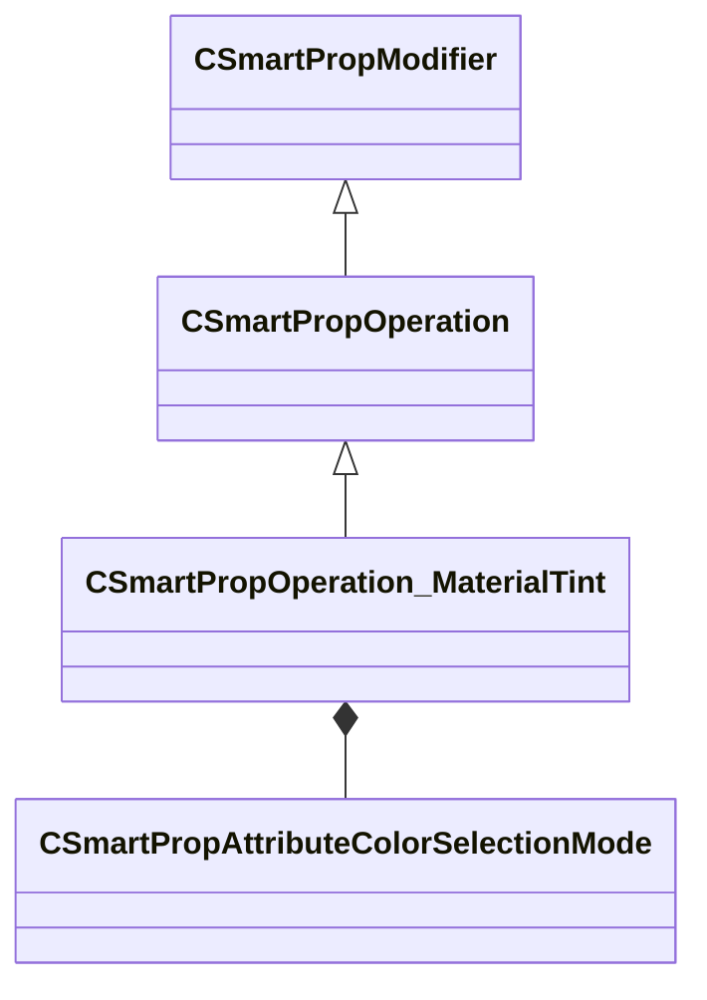

[Schemas](../../schemas.md) / [smartprops](../smartprops.md) / CSmartPropOperation_MaterialTint

# CSmartPropOperation_MaterialTint

> Source: **Build 25000182** · 2026-08-28 · `windows-x86_64` · schema `0.10.0`

**Kind:** class · **Size:** 360 bytes (`0x168`) · **Align:** 8 · **Module:** smartprops

**Inherits from:** [CSmartPropOperation](../smartprops/CSmartPropOperation.md)

**Metadata:** `MPropertyDescription Set a color tint to apply to a specific material.`, `MPropertyFriendlyName Material Color Tint`, `MVDataClassGroup Color`

**Relationships:**

## Memory layout

6 fields (5 declared here, 1 inherited). Offsets are absolute from the object base.

| Offset | Field | Type | From | Annotations |
|--------|-------|------|------|-------------|
| `0x8` | `m_bEnabled` | CSmartPropAttributeBool | [CSmartPropModifier](../smartprops/CSmartPropModifier.md) | `MVDataEnableKey` |
| `0x50` | `m_Material` | CSmartPropAttributeMaterialName |  | `MPropertyAttributeEditor SmartPropAttributeEditor(MaterialInSmartProp)` `MPropertyDescription Material to which color tint is to be applied.` `MPropertyFriendlyName Material` |
| `0x90` | `m_SelectionMode` | [CSmartPropAttributeColorSelectionMode](../smartprops/CSmartPropAttributeColorSelectionMode.md) |  | `MPropertyDescription Specifies how the color is to be specified.` `MPropertyFriendlyName Selection Mode` |
| `0xd0` | `m_Color` | CSmartPropAttributeColor |  | `MPropertyDescription Color to be applied if this choice is selected.` `MPropertySuppressExpr m_SelectionMode != SPECIFIC_COLOR` |
| `0x110` | `m_Gradient` | CColorGradient |  | `MPropertyDescription Defines a color gradient from which a color can be selected based on the selection mode.` `MPropertyFriendlyName Color Gradient` `MPropertySuppressExpr m_SelectionMode == SPECIFIC_COLOR` |
| `0x128` | `m_ColorPosition` | CSmartPropAttributeFloat |  | `MPropertyDescription [ 0, 1 ] Value specifying the location on the gradient to pick the color from.` `MPropertyFriendlyName Color Position` `MPropertySuppressExpr m_SelectionMode != GRADIENT_LOCATION` |

KV3 class defaults

<pre>{
	&quot;_class&quot;: &quot;CSmartPropOperation_MaterialTint&quot;,
	&quot;m_bEnabled&quot;: true,
	&quot;m_Material&quot;: &quot;&quot;,
	&quot;m_SelectionMode&quot;: &quot;SPECIFIC_COLOR&quot;,
	&quot;m_Color&quot;:
	[
		255,
		255,
		255
	],
	&quot;m_Gradient&quot;:
	{
		&quot;m_Stops&quot;:
		[
		]
	},
	&quot;m_ColorPosition&quot;: 0.000000
}</pre>

