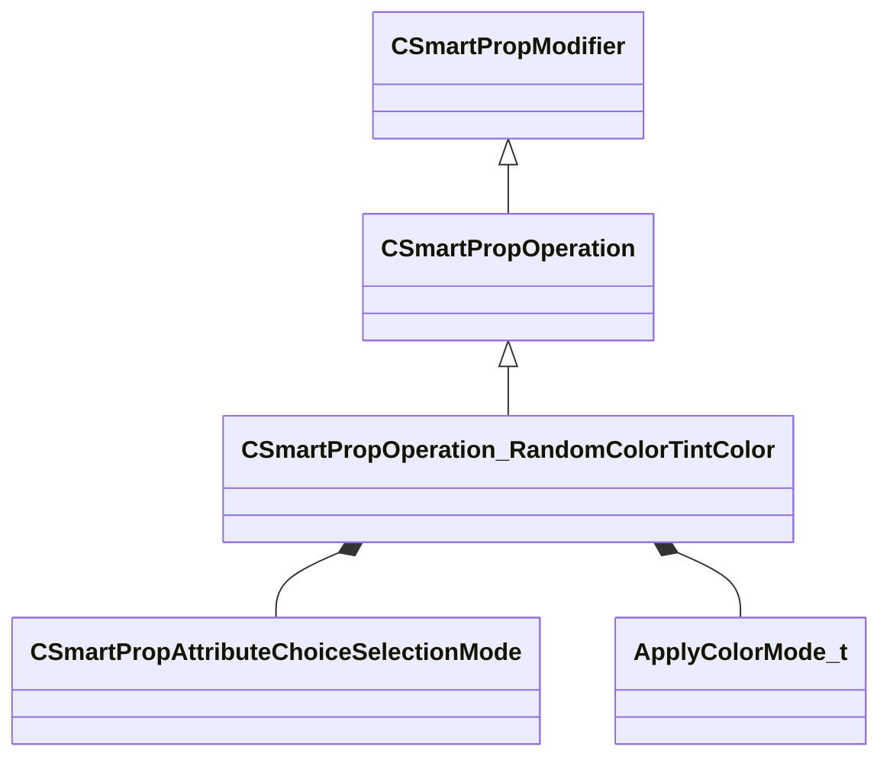

[Schemas](../../schemas.md) / [smartprops](../smartprops.md) / CSmartPropOperation_RandomColorTintColor

# CSmartPropOperation_RandomColorTintColor

**Kind:** class · **Size:** 240 bytes (`0xf0`) · **Align:** 8 · **Module:** smartprops

**Inherits from:** [CSmartPropOperation](../smartprops/CSmartPropOperation.md)

**Metadata:** `MPropertyDescription Set the color tint to a selection from within the defined gradient.`, `MPropertyFriendlyName Tint Color Gradient`, `MVDataClassGroup Color`

**Relationships:**

## Memory layout

5 fields (4 declared here, 1 inherited). Offsets are absolute from the object base.

| Offset | Field | Type | From | Annotations |
|--------|-------|------|------|-------------|
| `0x8` | `m_bEnabled` | CSmartPropAttributeBool | [CSmartPropModifier](../smartprops/CSmartPropModifier.md) | `MVDataEnableKey` |
| `0x50` | `m_SelectionMode` | [CSmartPropAttributeChoiceSelectionMode](../smartprops/CSmartPropAttributeChoiceSelectionMode.md) |  | `MPropertyDescription Specifies how the color is to be selected from the authored set of choices` `MPropertyFriendlyName Selection Mode` |
| `0x90` | `m_ColorPosition` | CSmartPropAttributeFloat |  | `MPropertyDescription [ 0, 1 ] Value specifying the location on the gradient to pick the color from.` `MPropertyFriendlyName Color Position` `MPropertySuppressExpr ( m_SelectionMode != SPECIFIC )` |
| `0xd0` | `m_Mode` | [ApplyColorMode_t](../!GlobalTypes/ApplyColorMode_t.md) |  | `MPropertyDescription Specifies how the selected color should be applied to the current color.` `MPropertyFriendlyName Application Mode` |
| `0xd8` | `m_Gradient` | CColorGradient |  | `MPropertyDescription Defines a color gradient from which a random color will be piked.` |

KV3 class defaults

<pre>{
	&quot;_class&quot;: &quot;CSmartPropOperation_RandomColorTintColor&quot;,
	&quot;m_bEnabled&quot;: true,
	&quot;m_SelectionMode&quot;: &quot;RANDOM&quot;,
	&quot;m_ColorPosition&quot;: 0.000000,
	&quot;m_Mode&quot;: &quot;MULTIPLY_OBJECT&quot;,
	&quot;m_Gradient&quot;:
	{
		&quot;m_Stops&quot;:
		[
		]
	}
}</pre>

