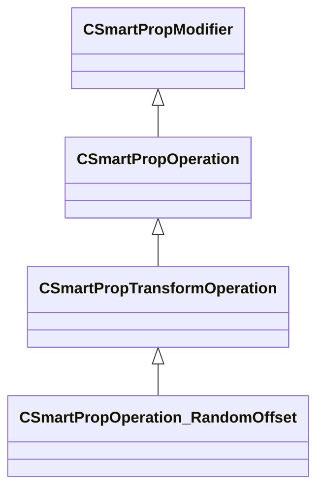

[Schemas](../../schemas.md) / [smartprops](../smartprops.md) / CSmartPropOperation_RandomOffset

# CSmartPropOperation_RandomOffset

> Source: **Build 25000182** · 2026-08-28 · `windows-x86_64` · schema `0.10.0`

**Kind:** class · **Size:** 272 bytes (`0x110`) · **Align:** 8 · **Module:** smartprops

**Inherits from:** [CSmartPropTransformOperation](../smartprops/CSmartPropTransformOperation.md)

**Metadata:** `MPropertyDescription Apply a random position offset to the current transform.`, `MPropertyFriendlyName Transform: Random Offset`, `MVDataClassGroup Transform`

**Relationships:**

## Memory layout

4 fields (3 declared here, 1 inherited). Offsets are absolute from the object base.

| Offset | Field | Type | From | Annotations |
|--------|-------|------|------|-------------|
| `0x8` | `m_bEnabled` | CSmartPropAttributeBool | [CSmartPropModifier](../smartprops/CSmartPropModifier.md) | `MVDataEnableKey` |
| `0x50` | `m_vRandomPositionMin` | CSmartPropAttributeVector |  | `MPropertyDescription Minimum random position offset` |
| `0x90` | `m_vRandomPositionMax` | CSmartPropAttributeVector |  | `MPropertyDescription Maximum random position offset` |
| `0xd0` | `m_vSnapIncrement` | CSmartPropAttributeVector |  | `MPropertyDescription If non-zero, specifies the increment to which the randomly selected offset value will be snapped. Note that the snap value is absolute, not relative to the min or max, but if the if the min or max are not multiples of the snap value they can still be selected.` |

KV3 class defaults

<pre>{
	&quot;_class&quot;: &quot;CSmartPropOperation_RandomOffset&quot;,
	&quot;m_bEnabled&quot;: true,
	&quot;m_vRandomPositionMin&quot;:
	[
		0.000000,
		0.000000,
		0.000000
	],
	&quot;m_vRandomPositionMax&quot;:
	[
		0.000000,
		0.000000,
		0.000000
	],
	&quot;m_vSnapIncrement&quot;:
	[
		0.000000,
		0.000000,
		0.000000
	]
}</pre>

