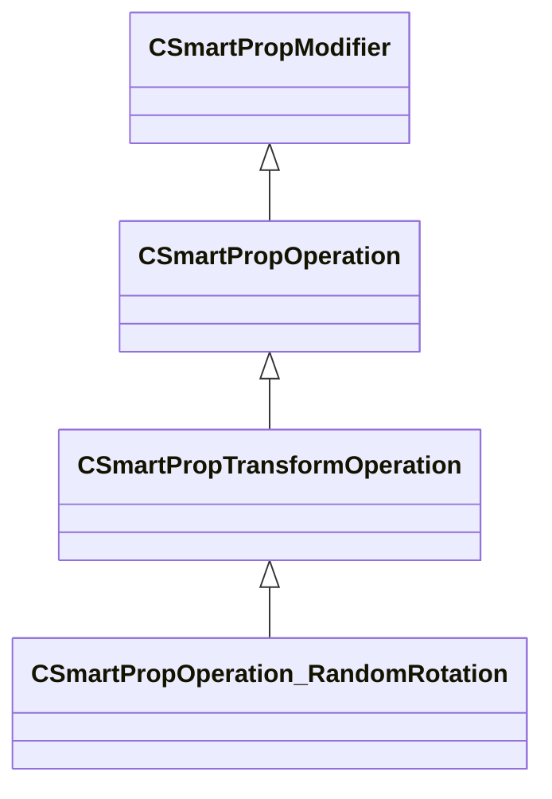

[Schemas](../../schemas.md) / [smartprops](../smartprops.md) / CSmartPropOperation_RandomRotation

# CSmartPropOperation_RandomRotation

> Source: **Build 25000182** · 2026-08-28 · `windows-x86_64` · schema `0.10.0`

**Kind:** class · **Size:** 272 bytes (`0x110`) · **Align:** 8 · **Module:** smartprops

**Inherits from:** [CSmartPropTransformOperation](../smartprops/CSmartPropTransformOperation.md)

**Metadata:** `MPropertyDescription Apply a random rotation to the current transform.`, `MPropertyFriendlyName Transform: Random Rotation`, `MVDataClassGroup Transform`

**Relationships:**

## Memory layout

4 fields (3 declared here, 1 inherited). Offsets are absolute from the object base.

| Offset | Field | Type | From | Annotations |
|--------|-------|------|------|-------------|
| `0x8` | `m_bEnabled` | CSmartPropAttributeBool | [CSmartPropModifier](../smartprops/CSmartPropModifier.md) | `MVDataEnableKey` |
| `0x50` | `m_vRandomRotationMin` | CSmartPropAttributeAngles |  | `MPropertyDescription Minimum rotation range` |
| `0x90` | `m_vRandomRotationMax` | CSmartPropAttributeAngles |  | `MPropertyDescription Maximum rotation range` |
| `0xd0` | `m_vSnapIncrement` | CSmartPropAttributeAngles |  | `MPropertyDescription If non-zero, specifies the angle increment to which the randomly selected value will be snapped. Note that the snap value is absolute, not relative to the min or max, but if the if the min or max are not multiples of the snap value they can still be selected.` |

KV3 class defaults

<pre>{
	&quot;_class&quot;: &quot;CSmartPropOperation_RandomRotation&quot;,
	&quot;m_bEnabled&quot;: true,
	&quot;m_vRandomRotationMin&quot;:
	[
		0.000000,
		0.000000,
		0.000000
	],
	&quot;m_vRandomRotationMax&quot;:
	[
		0.000000,
		0.000000,
		0.000000
	],
	&quot;m_vSnapIncrement&quot;:
	[
		0.000000,
		0.000000,
		0.000000
	]
}</pre>

