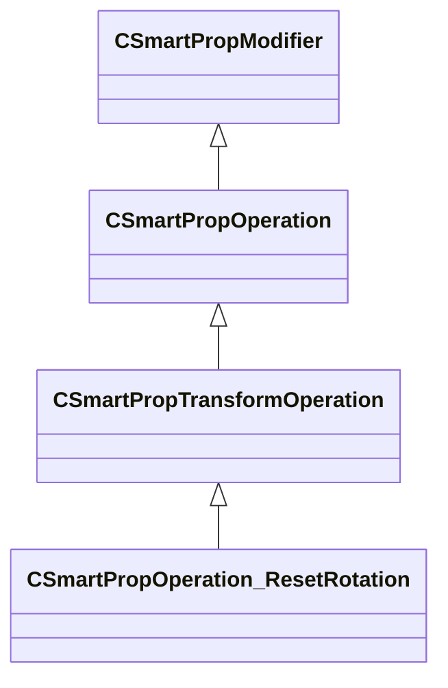

[Schemas](../../schemas.md) / [smartprops](../smartprops.md) / CSmartPropOperation_ResetRotation

# CSmartPropOperation_ResetRotation

**Kind:** class · **Size:** 336 bytes (`0x150`) · **Align:** 8 · **Module:** smartprops

**Inherits from:** [CSmartPropTransformOperation](../smartprops/CSmartPropTransformOperation.md)

**Metadata:** `MPropertyDescription Reset the current rotation such the element only inherits the object level rotation, but does not inherit the rotation applied to its parent.`, `MPropertyFriendlyName Transform: Reset Rotation`, `MVDataClassGroup Transform`

**Relationships:**

## Memory layout

5 fields (4 declared here, 1 inherited). Offsets are absolute from the object base.

| Offset | Field | Type | From | Annotations |
|--------|-------|------|------|-------------|
| `0x8` | `m_bEnabled` | CSmartPropAttributeBool | [CSmartPropModifier](../smartprops/CSmartPropModifier.md) | `MVDataEnableKey` |
| `0x50` | `m_bIgnoreObjectRotation` | CSmartPropAttributeBool |  | `MPropertyDescription If enabled, the rotation will be reset to a world space instead of object space, meaning any rotation applied to the object in Hammer will be ignored.` |
| `0x90` | `m_bResetPitch` | CSmartPropAttributeBool |  | `MPropertyDescription Should the pitch (rotation around left vector) value be reset.` |
| `0xd0` | `m_bResetYaw` | CSmartPropAttributeBool |  | `MPropertyDescription Should the yaw (roation around the up vector) value be reset.` |
| `0x110` | `m_bResetRoll` | CSmartPropAttributeBool |  | `MPropertyDescription Should the roll (rotation around forward vector) value be reset.` |

KV3 class defaults

<pre>{
	&quot;_class&quot;: &quot;CSmartPropOperation_ResetRotation&quot;,
	&quot;m_bEnabled&quot;: true,
	&quot;m_bIgnoreObjectRotation&quot;: false,
	&quot;m_bResetPitch&quot;: true,
	&quot;m_bResetYaw&quot;: true,
	&quot;m_bResetRoll&quot;: true
}</pre>

