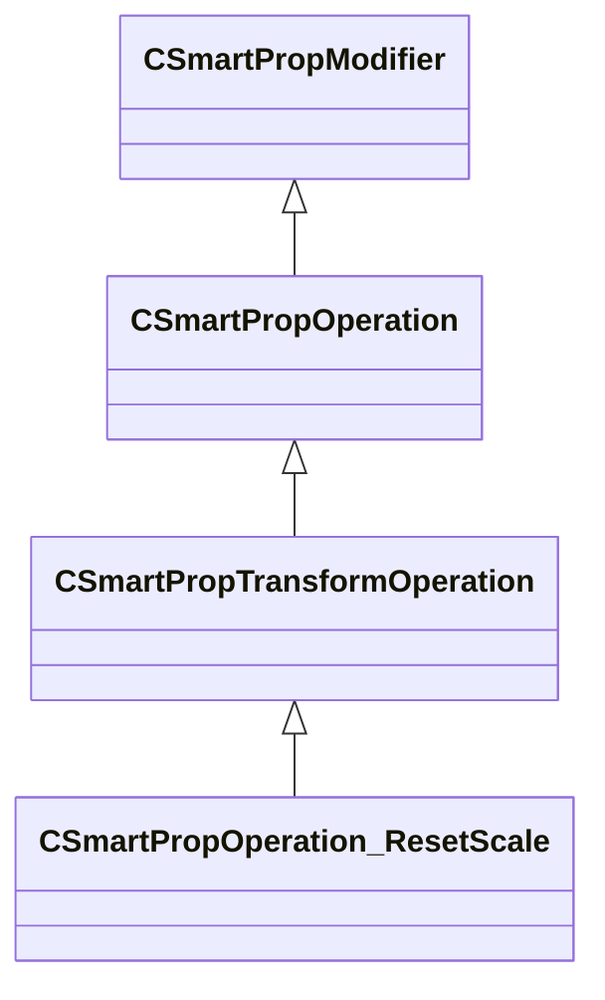

[Schemas](../../schemas.md) / [smartprops](../smartprops.md) / CSmartPropOperation_ResetScale

# CSmartPropOperation_ResetScale

**Kind:** class · **Size:** 144 bytes (`0x90`) · **Align:** 8 · **Module:** smartprops

**Inherits from:** [CSmartPropTransformOperation](../smartprops/CSmartPropTransformOperation.md)

**Metadata:** `MPropertyDescription Reset the current scale such the element only inherits the object level scale, but does not inherit the scale applied to its parent.`, `MPropertyFriendlyName Transform: Reset Scale`, `MVDataClassGroup Transform`

**Relationships:**

## Memory layout

2 fields (1 declared here, 1 inherited). Offsets are absolute from the object base.

| Offset | Field | Type | From | Annotations |
|--------|-------|------|------|-------------|
| `0x8` | `m_bEnabled` | CSmartPropAttributeBool | [CSmartPropModifier](../smartprops/CSmartPropModifier.md) | `MVDataEnableKey` |
| `0x50` | `m_bIgnoreObjectScale` | CSmartPropAttributeBool |  | `MPropertyDescription If enabled, the object level scale will be ignored, meaning any scale applied in Hammer will have no effect on the element or its children.` |

KV3 class defaults

<pre>{
	&quot;_class&quot;: &quot;CSmartPropOperation_ResetScale&quot;,
	&quot;m_bEnabled&quot;: true,
	&quot;m_bIgnoreObjectScale&quot;: false
}</pre>

