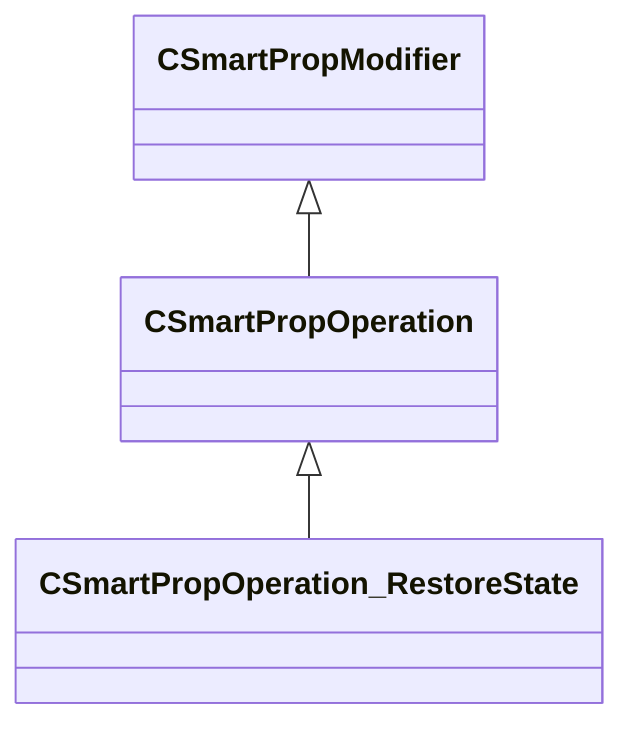

[Schemas](../../schemas.md) / [smartprops](../smartprops.md) / CSmartPropOperation_RestoreState

# CSmartPropOperation_RestoreState

> Source: **Build 25000182** · 2026-08-28 · `windows-x86_64` · schema `0.10.0`

**Kind:** class · **Size:** 208 bytes (`0xd0`) · **Align:** 8 · **Module:** smartprops

**Inherits from:** [CSmartPropOperation](../smartprops/CSmartPropOperation.md)

**Metadata:** `MPropertyDescription Replace the current state with a previously saved state.`, `MPropertyFriendlyName Restore State`, `MVDataClassGroup State`, `MVDataNodeTintColor`

**Relationships:**

## Memory layout

3 fields (2 declared here, 1 inherited). Offsets are absolute from the object base.

| Offset | Field | Type | From | Annotations |
|--------|-------|------|------|-------------|
| `0x8` | `m_bEnabled` | CSmartPropAttributeBool | [CSmartPropModifier](../smartprops/CSmartPropModifier.md) | `MVDataEnableKey` |
| `0x50` | `m_StateName` | CSmartPropAttributeStateName |  | `MPropertyAttributeEditor SmartPropItemNameEditor( SavedState )` `MPropertyDescription Name of the previously saved state to restore` |
| `0x90` | `m_bDiscardIfUknown` | CSmartPropAttributeBool |  | `MPropertyDescription If true, the parent element will be discarded there is no state with the specified name. If false, and there is no state with the specified name then no changes are made.` |

KV3 class defaults

<pre>{
	&quot;_class&quot;: &quot;CSmartPropOperation_RestoreState&quot;,
	&quot;m_bEnabled&quot;: true,
	&quot;m_StateName&quot;: &quot;&quot;,
	&quot;m_bDiscardIfUknown&quot;: false
}</pre>

