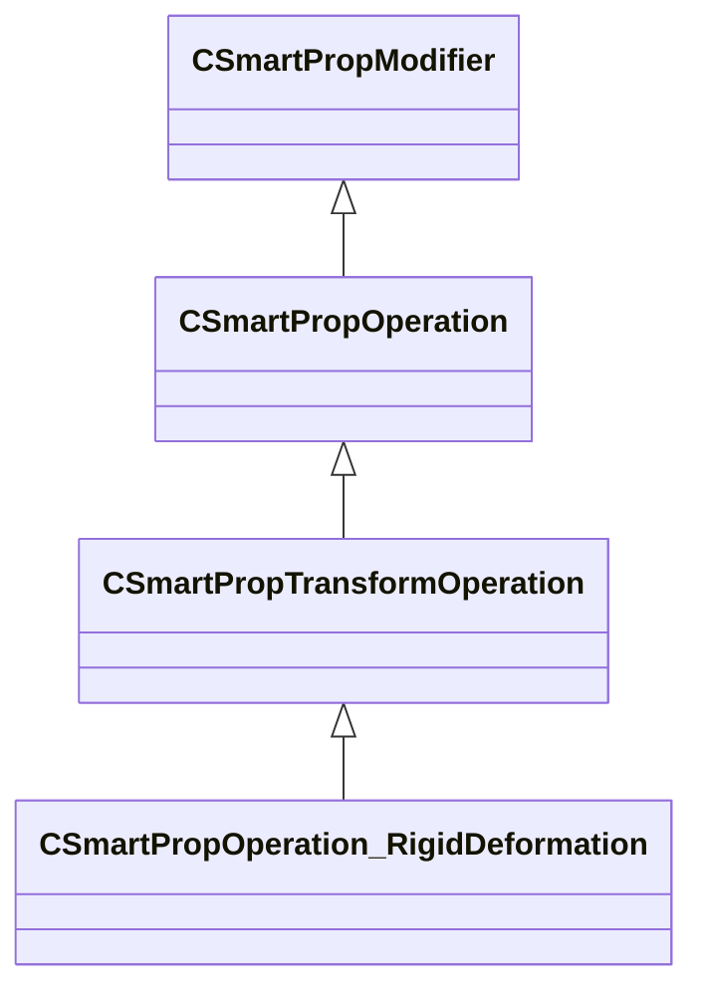

[Schemas](../../schemas.md) / [smartprops](../smartprops.md) / CSmartPropOperation_RigidDeformation

# CSmartPropOperation_RigidDeformation

**Kind:** class · **Size:** 80 bytes (`0x50`) · **Align:** 8 · **Module:** smartprops

**Inherits from:** [CSmartPropTransformOperation](../smartprops/CSmartPropTransformOperation.md)

**Metadata:** `MPropertyDescription Apply the active deformer to the current transform as a rigid deformation and disable the deformer.`, `MPropertyFriendlyName Transform: Rigid Deformation`, `MVDataClassGroup Transform`, `MVDataComponentRequiresAncestor`

**Relationships:**

## Memory layout

1 fields (0 declared here, 1 inherited). Offsets are absolute from the object base.

| Offset | Field | Type | From | Annotations |
|--------|-------|------|------|-------------|
| `0x8` | `m_bEnabled` | CSmartPropAttributeBool | [CSmartPropModifier](../smartprops/CSmartPropModifier.md) | `MVDataEnableKey` |

KV3 class defaults

<pre>{
	&quot;_class&quot;: &quot;CSmartPropOperation_RigidDeformation&quot;,
	&quot;m_bEnabled&quot;: true
}</pre>

