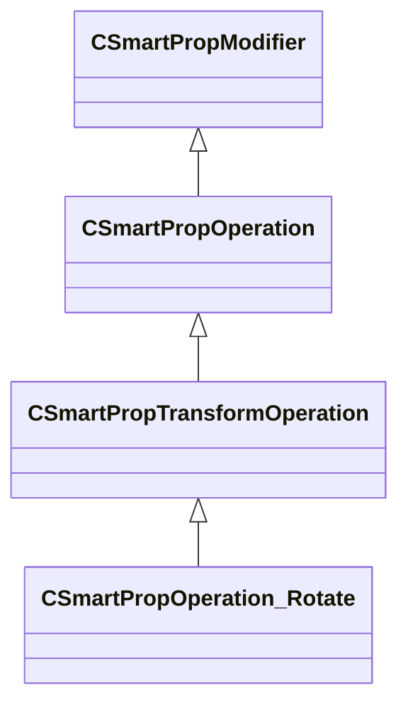

[Schemas](../../schemas.md) / [smartprops](../smartprops.md) / CSmartPropOperation_Rotate

# CSmartPropOperation_Rotate

> Source: **Build 25000182** · 2026-08-28 · `windows-x86_64` · schema `0.10.0`

**Kind:** class · **Size:** 144 bytes (`0x90`) · **Align:** 8 · **Module:** smartprops

**Inherits from:** [CSmartPropTransformOperation](../smartprops/CSmartPropTransformOperation.md)

**Metadata:** `MPropertyDescription Apply a rotation to the current transform.`, `MPropertyFriendlyName Transform: Rotate`, `MVDataClassGroup Transform`

**Relationships:**

## Memory layout

2 fields (1 declared here, 1 inherited). Offsets are absolute from the object base.

| Offset | Field | Type | From | Annotations |
|--------|-------|------|------|-------------|
| `0x8` | `m_bEnabled` | CSmartPropAttributeBool | [CSmartPropModifier](../smartprops/CSmartPropModifier.md) | `MVDataEnableKey` |
| `0x50` | `m_vRotation` | CSmartPropAttributeAngles |  | `MPropertyDescription Local space rotation (in degrees) to apply to the current transform` |

KV3 class defaults

<pre>{
	&quot;_class&quot;: &quot;CSmartPropOperation_Rotate&quot;,
	&quot;m_bEnabled&quot;: true,
	&quot;m_vRotation&quot;:
	[
		0.000000,
		0.000000,
		0.000000
	]
}</pre>

