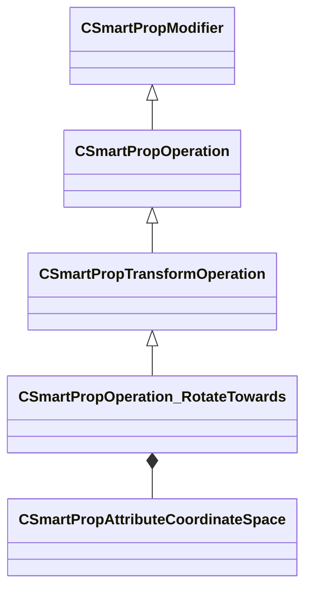

[Schemas](../../schemas.md) / [smartprops](../smartprops.md) / CSmartPropOperation_RotateTowards

# CSmartPropOperation_RotateTowards

> Source: **Build 25000182** · 2026-08-28 · `windows-x86_64` · schema `0.10.0`

**Kind:** class · **Size:** 528 bytes (`0x210`) · **Align:** 8 · **Module:** smartprops

**Inherits from:** [CSmartPropTransformOperation](../smartprops/CSmartPropTransformOperation.md)

**Metadata:** `MPropertyDescription Apply a rotation to the current transform according to the alignment of two points.`, `MPropertyFriendlyName Transform: Rotate Towards`, `MVDataClassGroup Transform`, `MVDataExperimentalNodeSet`

**Relationships:**

## Memory layout

8 fields (7 declared here, 1 inherited). Offsets are absolute from the object base.

| Offset | Field | Type | From | Annotations |
|--------|-------|------|------|-------------|
| `0x8` | `m_bEnabled` | CSmartPropAttributeBool | [CSmartPropModifier](../smartprops/CSmartPropModifier.md) | `MVDataEnableKey` |
| `0x50` | `m_vOriginPos` | CSmartPropAttributeVector |  | `MPropertyDescription Position of origin point.` |
| `0x90` | `m_vTargetPos` | CSmartPropAttributeVector |  | `MPropertyDescription position of target point.` |
| `0xd0` | `m_vUpPos` | CSmartPropAttributeVector |  | `MPropertyDescription position of up point.` |
| `0x110` | `m_flWeight` | CSmartPropAttributeFloat |  | `MPropertyDescription Coefficient to modulate the rotation` |
| `0x150` | `m_OriginSpace` | [CSmartPropAttributeCoordinateSpace](../smartprops/CSmartPropAttributeCoordinateSpace.md) |  | `MPropertyDescription Space in which the origin position is defined.` `MPropertyGroupName Input Coordinate Space` |
| `0x190` | `m_TargetSpace` | [CSmartPropAttributeCoordinateSpace](../smartprops/CSmartPropAttributeCoordinateSpace.md) |  | `MPropertyDescription Space in which the target position is defined.` `MPropertyGroupName Input Coordinate Space` |
| `0x1d0` | `m_UpSpace` | [CSmartPropAttributeCoordinateSpace](../smartprops/CSmartPropAttributeCoordinateSpace.md) |  | `MPropertyDescription Space in which the up target is defined.` `MPropertyGroupName Input Coordinate Space` |

KV3 class defaults

<pre>{
	&quot;_class&quot;: &quot;CSmartPropOperation_RotateTowards&quot;,
	&quot;m_bEnabled&quot;: true,
	&quot;m_vOriginPos&quot;:
	[
		0.000000,
		0.000000,
		0.000000
	],
	&quot;m_vTargetPos&quot;:
	[
		1.000000,
		0.000000,
		0.000000
	],
	&quot;m_vUpPos&quot;:
	[
		0.000000,
		0.000000,
		1.000000
	],
	&quot;m_flWeight&quot;: 1.000000,
	&quot;m_OriginSpace&quot;: &quot;WORLD&quot;,
	&quot;m_TargetSpace&quot;: &quot;WORLD&quot;,
	&quot;m_UpSpace&quot;: &quot;WORLD&quot;
}</pre>

