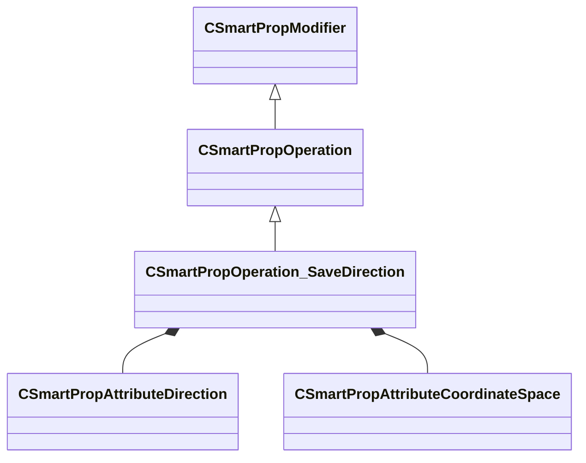

[Schemas](../../schemas.md) / [smartprops](../smartprops.md) / CSmartPropOperation_SaveDirection

# CSmartPropOperation_SaveDirection

> Source: **Build 25000182** · 2026-08-28 · `windows-x86_64` · schema `0.10.0`

**Kind:** class · **Size:** 216 bytes (`0xd8`) · **Align:** 8 · **Module:** smartprops

**Inherits from:** [CSmartPropOperation](../smartprops/CSmartPropOperation.md)

**Metadata:** `MPropertyDescription Save the specified direction vector to a specified variable, in the requested coordinate space`, `MPropertyFriendlyName Save Direction Vector`, `MVDataClassGroup State`

**Relationships:**

## Memory layout

4 fields (3 declared here, 1 inherited). Offsets are absolute from the object base.

| Offset | Field | Type | From | Annotations |
|--------|-------|------|------|-------------|
| `0x8` | `m_bEnabled` | CSmartPropAttributeBool | [CSmartPropModifier](../smartprops/CSmartPropModifier.md) | `MVDataEnableKey` |
| `0x50` | `m_DirectionVector` | [CSmartPropAttributeDirection](../smartprops/CSmartPropAttributeDirection.md) |  | `MPropertyDescription Specifies which direction vector to save.` |
| `0x90` | `m_CoordinateSpace` | [CSmartPropAttributeCoordinateSpace](../smartprops/CSmartPropAttributeCoordinateSpace.md) |  | `MPropertyDescription Specifies the coordinate space of the saved position value.` |
| `0xd0` | `m_VariableName` | CUtlString |  | `MPropertyAttributeEditor SmartPropItemNameEditor( Variable:Vector3 )` |

KV3 class defaults

<pre>{
	&quot;_class&quot;: &quot;CSmartPropOperation_SaveDirection&quot;,
	&quot;m_bEnabled&quot;: true,
	&quot;m_DirectionVector&quot;: &quot;FORWARD&quot;,
	&quot;m_CoordinateSpace&quot;: &quot;WORLD&quot;,
	&quot;m_VariableName&quot;: &quot;&quot;
}</pre>

