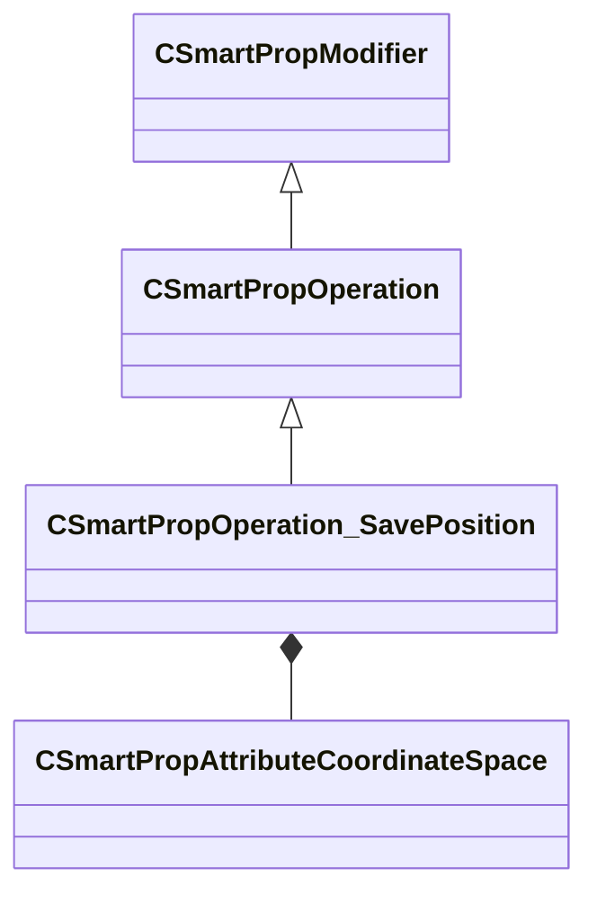

[Schemas](../../schemas.md) / [smartprops](../smartprops.md) / CSmartPropOperation_SavePosition

# CSmartPropOperation_SavePosition

**Kind:** class · **Size:** 152 bytes (`0x98`) · **Align:** 8 · **Module:** smartprops

**Inherits from:** [CSmartPropOperation](../smartprops/CSmartPropOperation.md)

**Metadata:** `MPropertyDescription Save the current position to a specified variable in the requested coordinate space`, `MPropertyFriendlyName Save Current Position`, `MVDataClassGroup State`

**Relationships:**

## Memory layout

3 fields (2 declared here, 1 inherited). Offsets are absolute from the object base.

| Offset | Field | Type | From | Annotations |
|--------|-------|------|------|-------------|
| `0x8` | `m_bEnabled` | CSmartPropAttributeBool | [CSmartPropModifier](../smartprops/CSmartPropModifier.md) | `MVDataEnableKey` |
| `0x50` | `m_CoordinateSpace` | [CSmartPropAttributeCoordinateSpace](../smartprops/CSmartPropAttributeCoordinateSpace.md) |  | `MPropertyDescription Specifies the coordinate space of the saved position value.` |
| `0x90` | `m_VariableName` | CUtlString |  | `MPropertyAttributeEditor SmartPropItemNameEditor( Variable:Vector3 )` |

KV3 class defaults

<pre>{
	&quot;_class&quot;: &quot;CSmartPropOperation_SavePosition&quot;,
	&quot;m_bEnabled&quot;: true,
	&quot;m_CoordinateSpace&quot;: &quot;WORLD&quot;,
	&quot;m_VariableName&quot;: &quot;&quot;
}</pre>

