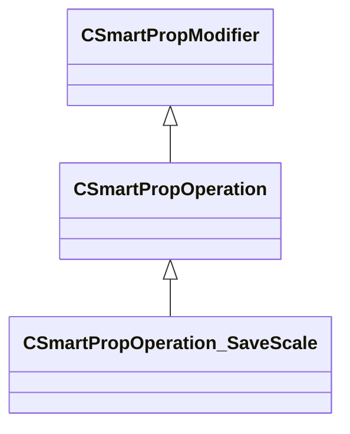

[Schemas](../../schemas.md) / [smartprops](../smartprops.md) / CSmartPropOperation_SaveScale

# CSmartPropOperation_SaveScale

> Source: **Build 25000182** · 2026-08-28 · `windows-x86_64` · schema `0.10.0`

**Kind:** class · **Size:** 88 bytes (`0x58`) · **Align:** 8 · **Module:** smartprops

**Inherits from:** [CSmartPropOperation](../smartprops/CSmartPropOperation.md)

**Metadata:** `MPropertyDescription Save the current scale factor to a specified variable.`, `MPropertyFriendlyName Save Current Scale`, `MVDataClassGroup State`

**Relationships:**

## Memory layout

2 fields (1 declared here, 1 inherited). Offsets are absolute from the object base.

| Offset | Field | Type | From | Annotations |
|--------|-------|------|------|-------------|
| `0x8` | `m_bEnabled` | CSmartPropAttributeBool | [CSmartPropModifier](../smartprops/CSmartPropModifier.md) | `MVDataEnableKey` |
| `0x50` | `m_VariableName` | CUtlString |  | `MPropertyAttributeEditor SmartPropItemNameEditor( Variable:Float )` |

KV3 class defaults

<pre>{
	&quot;_class&quot;: &quot;CSmartPropOperation_SaveScale&quot;,
	&quot;m_bEnabled&quot;: true,
	&quot;m_VariableName&quot;: &quot;&quot;
}</pre>

