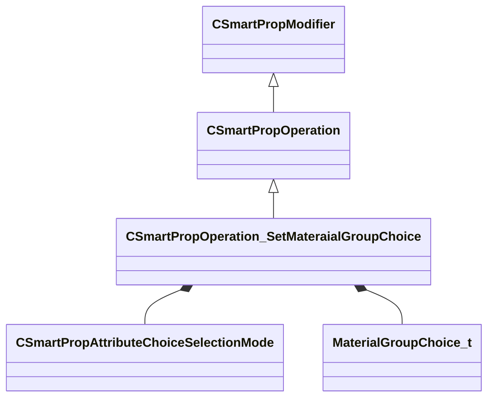

[Schemas](../../schemas.md) / [smartprops](../smartprops.md) / CSmartPropOperation_SetMateraialGroupChoice

# CSmartPropOperation_SetMateraialGroupChoice

**Kind:** class · **Size:** 240 bytes (`0xf0`) · **Align:** 8 · **Module:** smartprops

**Inherits from:** [CSmartPropOperation](../smartprops/CSmartPropOperation.md)

**Metadata:** `MPropertyDescription Picks a material group from a set of choices and assigns that material group to a specified variable.`, `MPropertyFriendlyName Set Material Group Choice`, `MVDataClassGroup Material`

**Relationships:**

## Memory layout

5 fields (4 declared here, 1 inherited). Offsets are absolute from the object base.

| Offset | Field | Type | From | Annotations |
|--------|-------|------|------|-------------|
| `0x8` | `m_bEnabled` | CSmartPropAttributeBool | [CSmartPropModifier](../smartprops/CSmartPropModifier.md) | `MVDataEnableKey` |
| `0x50` | `m_VariableName` | CUtlString |  | `MPropertyAttributeEditor SmartPropItemNameEditor( Variable:MaterialGroup )` `MPropertyDescription Material group variable to set to the selected choice.` `MPropertyProvidesEditContextString ToolEditContext_ID_SmartProp_Variable` |
| `0x58` | `m_SelectionMode` | [CSmartPropAttributeChoiceSelectionMode](../smartprops/CSmartPropAttributeChoiceSelectionMode.md) |  | `MPropertyDescription Specifies how the material group is to be selected from the authored set of choices` `MPropertyFriendlyName Selection Mode` |
| `0x98` | `m_ChoiceSelection` | CSmartPropAttributeInt |  | `MPropertyDescription Specifies the index of the material group choice to pick` `MPropertyFriendlyName Choice Index` `MPropertySuppressExpr ( m_SelectionMode != SPECIFIC )` |
| `0xd8` | `m_MaterialGroupChoices` | CUtlVector< [MaterialGroupChoice_t](../smartprops/MaterialGroupChoice_t.md) > |  | `MPropertyAutoExpandSelf` |

KV3 class defaults

<pre>{
	&quot;_class&quot;: &quot;CSmartPropOperation_SetMateraialGroupChoice&quot;,
	&quot;m_bEnabled&quot;: true,
	&quot;m_VariableName&quot;: &quot;&quot;,
	&quot;m_SelectionMode&quot;: &quot;RANDOM&quot;,
	&quot;m_ChoiceSelection&quot;: 0,
	&quot;m_MaterialGroupChoices&quot;:
	[
	]
}</pre>

