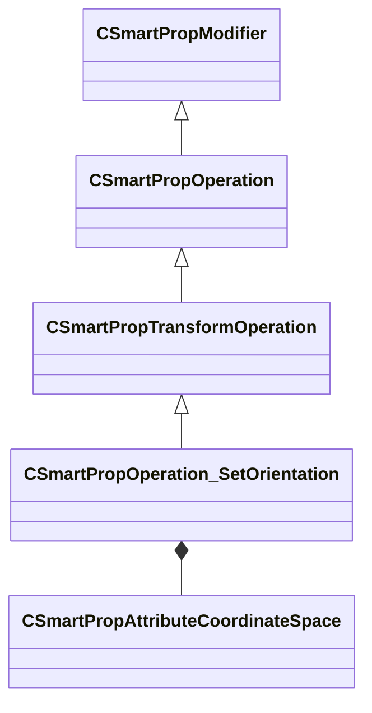

[Schemas](../../schemas.md) / [smartprops](../smartprops.md) / CSmartPropOperation_SetOrientation

# CSmartPropOperation_SetOrientation

> Source: **Build 25000182** · 2026-08-28 · `windows-x86_64` · schema `0.10.0`

**Kind:** class · **Size:** 400 bytes (`0x190`) · **Align:** 8 · **Module:** smartprops

**Inherits from:** [CSmartPropTransformOperation](../smartprops/CSmartPropTransformOperation.md)

**Metadata:** `MPropertyDescription Set the current orientation from a specified forward and up vector.`, `MPropertyFriendlyName Transform: Set Orientation`, `MVDataClassGroup Transform`

**Relationships:**

## Memory layout

6 fields (5 declared here, 1 inherited). Offsets are absolute from the object base.

| Offset | Field | Type | From | Annotations |
|--------|-------|------|------|-------------|
| `0x8` | `m_bEnabled` | CSmartPropAttributeBool | [CSmartPropModifier](../smartprops/CSmartPropModifier.md) | `MVDataEnableKey` |
| `0x50` | `m_vForwardVector` | CSmartPropAttributeVector |  | `MPropertyGroupName +Forward` |
| `0x90` | `m_ForwardDirectionSpace` | [CSmartPropAttributeCoordinateSpace](../smartprops/CSmartPropAttributeCoordinateSpace.md) |  | `MPropertyDescription Specifies the coordinate space the forward direction is being specified in` `MPropertyGroupName +Forward` |
| `0xd0` | `m_vUpVector` | CSmartPropAttributeVector |  | `MPropertyGroupName +Up` |
| `0x110` | `m_UpDirectionSpace` | [CSmartPropAttributeCoordinateSpace](../smartprops/CSmartPropAttributeCoordinateSpace.md) |  | `MPropertyDescription Specifies the coordinate space the up direction is being specified in` `MPropertyGroupName +Up` |
| `0x150` | `m_bPrioritizeUp` | CSmartPropAttributeBool |  | `MPropertyDescription If the specified vectors are not orthogonal, normally the up vector will be adjusted to make it orthogonal to the forward vector. If prioritize up is true, then the forward vector will be adjusted to be orthogonal to the specified up vector instead.` |

KV3 class defaults

<pre>{
	&quot;_class&quot;: &quot;CSmartPropOperation_SetOrientation&quot;,
	&quot;m_bEnabled&quot;: true,
	&quot;m_vForwardVector&quot;:
	[
		1.000000,
		0.000000,
		0.000000
	],
	&quot;m_ForwardDirectionSpace&quot;: &quot;WORLD&quot;,
	&quot;m_vUpVector&quot;:
	[
		0.000000,
		0.000000,
		1.000000
	],
	&quot;m_UpDirectionSpace&quot;: &quot;WORLD&quot;,
	&quot;m_bPrioritizeUp&quot;: false
}</pre>

