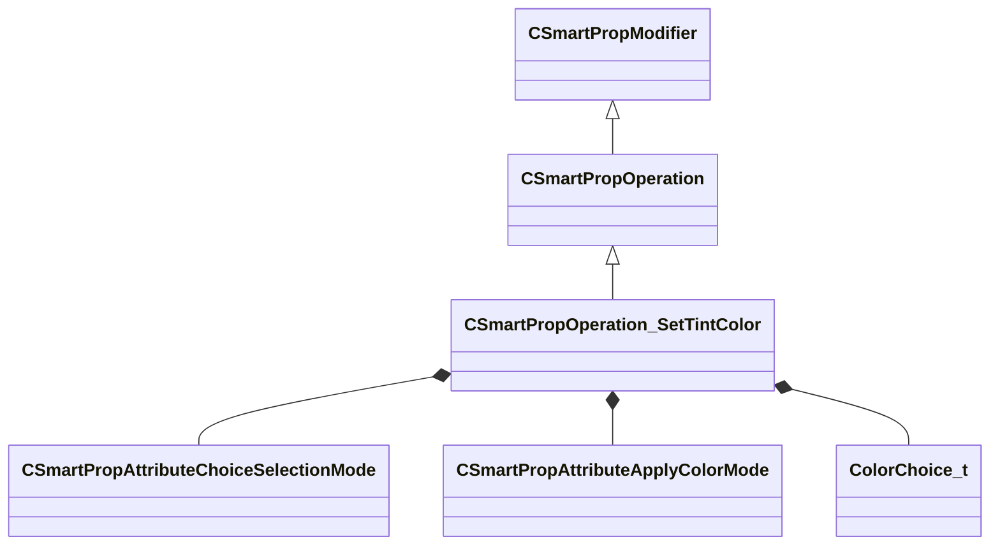

[Schemas](../../schemas.md) / [smartprops](../smartprops.md) / CSmartPropOperation_SetTintColor

# CSmartPropOperation_SetTintColor

> Source: **Build 25000182** · 2026-08-28 · `windows-x86_64` · schema `0.10.0`

**Kind:** class · **Size:** 296 bytes (`0x128`) · **Align:** 8 · **Module:** smartprops

**Inherits from:** [CSmartPropOperation](../smartprops/CSmartPropOperation.md)

**Metadata:** `MPropertyDescription Set the color tint to one color out of a pre-selected set of colors.`, `MPropertyFriendlyName Tint Color Choice`, `MVDataClassGroup Color`

**Relationships:**

## Memory layout

5 fields (4 declared here, 1 inherited). Offsets are absolute from the object base.

| Offset | Field | Type | From | Annotations |
|--------|-------|------|------|-------------|
| `0x8` | `m_bEnabled` | CSmartPropAttributeBool | [CSmartPropModifier](../smartprops/CSmartPropModifier.md) | `MVDataEnableKey` |
| `0x50` | `m_SelectionMode` | [CSmartPropAttributeChoiceSelectionMode](../smartprops/CSmartPropAttributeChoiceSelectionMode.md) |  | `MPropertyDescription Specifies how the color is to be selected from the authored set of choices` `MPropertyFriendlyName Selection Mode` |
| `0x90` | `m_ColorSelection` | CSmartPropAttributeInt |  | `MPropertyDescription Specifies the index of the color to pick` `MPropertyFriendlyName Color Selection` `MPropertySuppressExpr ( m_SelectionMode != SPECIFIC )` |
| `0xd0` | `m_Mode` | [CSmartPropAttributeApplyColorMode](../smartprops/CSmartPropAttributeApplyColorMode.md) |  | `MPropertyDescription Specifies how the selected color should be applied to the current color.` `MPropertyFriendlyName Application Mode` |
| `0x110` | `m_ColorChoices` | CUtlVector< [ColorChoice_t](../smartprops/ColorChoice_t.md) > |  | `MPropertyDescription List of possible colors which may be selected` |

KV3 class defaults

<pre>{
	&quot;_class&quot;: &quot;CSmartPropOperation_SetTintColor&quot;,
	&quot;m_bEnabled&quot;: true,
	&quot;m_SelectionMode&quot;: &quot;RANDOM&quot;,
	&quot;m_ColorSelection&quot;: 0,
	&quot;m_Mode&quot;: &quot;MULTIPLY_OBJECT&quot;,
	&quot;m_ColorChoices&quot;:
	[
	]
}</pre>

