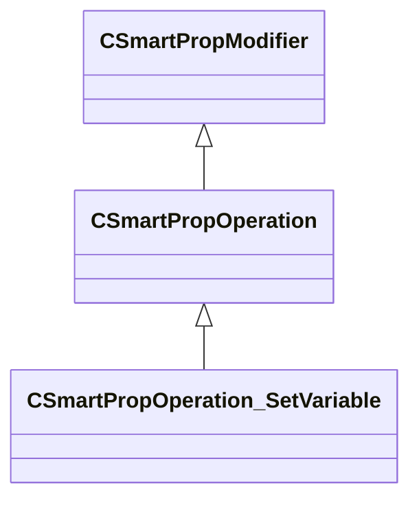

[Schemas](../../schemas.md) / [smartprops](../smartprops.md) / CSmartPropOperation_SetVariable

# CSmartPropOperation_SetVariable

**Kind:** class · **Size:** 144 bytes (`0x90`) · **Align:** 8 · **Module:** smartprops

**Inherits from:** [CSmartPropOperation](../smartprops/CSmartPropOperation.md)

**Metadata:** `MPropertyDescription Set the value of a variable.`, `MPropertyFriendlyName Set Variable`, `MVDataClassGroup State`, `MVDataOutlinerNameExpr m_VariableValue.m_TargetName`

**Relationships:**

## Memory layout

2 fields (1 declared here, 1 inherited). Offsets are absolute from the object base.

| Offset | Field | Type | From | Annotations |
|--------|-------|------|------|-------------|
| `0x8` | `m_bEnabled` | CSmartPropAttributeBool | [CSmartPropModifier](../smartprops/CSmartPropModifier.md) | `MVDataEnableKey` |
| `0x50` | `m_VariableValue` | CSmartPropAttributeVariableValue |  |  |

KV3 class defaults

<pre>{
	&quot;_class&quot;: &quot;CSmartPropOperation_SetVariable&quot;,
	&quot;m_bEnabled&quot;: true,
	&quot;m_VariableValue&quot;:
	{
		&quot;m_TargetName&quot;: &quot;&quot;,
		&quot;m_DataType&quot;: &quot;INVALID&quot;,
		&quot;m_Value&quot;: null
	}
}</pre>

