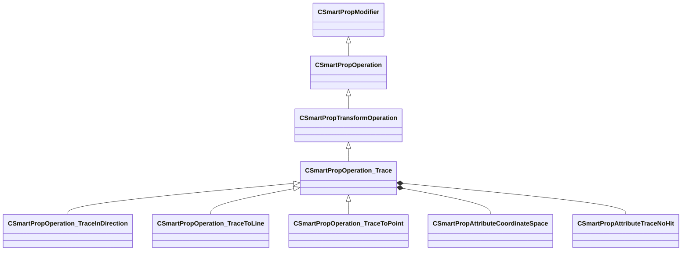

[Schemas](../../schemas.md) / [smartprops](../smartprops.md) / CSmartPropOperation_Trace

# CSmartPropOperation_Trace

> Source: **Build 25000182** · 2026-08-28 · `windows-x86_64` · schema `0.10.0`

**Kind:** class · **Size:** 848 bytes (`0x350`) · **Align:** n/a (unspecified) · **Module:** smartprops

**Inherits from:** [CSmartPropTransformOperation](../smartprops/CSmartPropTransformOperation.md)

**Derived by:** [CSmartPropOperation_TraceInDirection](../smartprops/CSmartPropOperation_TraceInDirection.md), [CSmartPropOperation_TraceToLine](../smartprops/CSmartPropOperation_TraceToLine.md), [CSmartPropOperation_TraceToPoint](../smartprops/CSmartPropOperation_TraceToPoint.md)

**Relationships:**

## Memory layout

13 fields (12 declared here, 1 inherited). Offsets are absolute from the object base.

| Offset | Field | Type | From | Annotations |
|--------|-------|------|------|-------------|
| `0x8` | `m_bEnabled` | CSmartPropAttributeBool | [CSmartPropModifier](../smartprops/CSmartPropModifier.md) | `MVDataEnableKey` |
| `0x50` | `m_Origin` | CSmartPropAttributeVector |  | `MPropertyDescription Specifies the origin point for the start of the trace. To trace from the current position, set to < 0, 0, 0 > and set the coordinate space to Element Space` `MPropertyStartGroup +Origin` |
| `0x90` | `m_OriginSpace` | [CSmartPropAttributeCoordinateSpace](../smartprops/CSmartPropAttributeCoordinateSpace.md) |  | `MPropertyDescription Coordinate space the origin is specified in. Using Element space allows specifying a value relative to the current position. However, world space should generally be used when for variable values.` |
| `0xd0` | `m_flOriginOffset` | CSmartPropAttributeFloat |  | `MPropertyDescription Offset to apply to the specified origin along the trace direction to compute the starting point of the trace.` |
| `0x110` | `m_flSurfaceUpInfluence` | CSmartPropAttributeFloat |  | `MPropertyDescription How much should the surface normal up direction influence the final orientation. [ 0, 1 ] where 0 = don't modify the orientation, 1 = completely re-orient to match the surface.` `MPropertySortPriority -1` `MPropertyStartGroup +Result` |
| `0x150` | `m_nNoHitResult` | [CSmartPropAttributeTraceNoHit](../smartprops/CSmartPropAttributeTraceNoHit.md) |  | `MPropertyDescription Specifies the behavior when the trace does not hit a surface.` `MPropertyFriendlyName If No Surface Hit` `MPropertySortPriority -1` |
| `0x190` | `m_bIgnoreToolMaterials` | CSmartPropAttributeBool |  | `MPropertyDescription Do not trace against tool materials (attribute 'tools.toolsmaterial').` `MPropertySortPriority -2` `MPropertyStartGroup Trace filtering` |
| `0x1d0` | `m_bIgnoreSky` | CSmartPropAttributeBool |  | `MPropertyDescription Do not trace against sky materials (attribute 'mapbuilder.sky').` `MPropertySortPriority -2` |
| `0x210` | `m_bIgnoreNoDraw` | CSmartPropAttributeBool |  | `MPropertyDescription Do not trace against no draw materials (material attribute 'mapbuilder.nodraw').` `MPropertySortPriority -2` |
| `0x250` | `m_bIgnoreTranslucent` | CSmartPropAttributeBool |  | `MPropertyDescription Do not trace against translucent materials (materials with 'alphatest' or 'translucent' attributes).` `MPropertySortPriority -2` |
| `0x290` | `m_bIgnoreModels` | CSmartPropAttributeBool |  | `MPropertyDescription Do not trace against any models (only hit world geometry).` `MPropertySortPriority -2` |
| `0x2d0` | `m_bIgnoreEntities` | CSmartPropAttributeBool |  | `MPropertyDescription Do not trace against dynamic entities which may move in game.` `MPropertySortPriority -2` |
| `0x310` | `m_bIgnoreCables` | CSmartPropAttributeBool |  | `MPropertyDescription Do not trace against cable geometry.` `MPropertySortPriority -2` |
