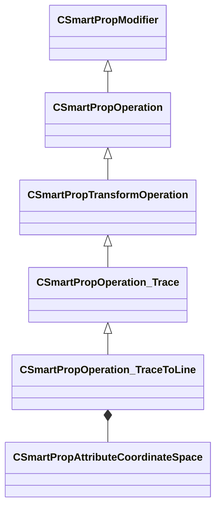

[Schemas](../../schemas.md) / [smartprops](../smartprops.md) / CSmartPropOperation_TraceToLine

# CSmartPropOperation_TraceToLine

> Source: **Build 25000182** · 2026-08-28 · `windows-x86_64` · schema `0.10.0`

**Kind:** class · **Size:** 1232 bytes (`0x4d0`) · **Align:** 8 · **Module:** smartprops

**Inherits from:** [CSmartPropOperation_Trace](../smartprops/CSmartPropOperation_Trace.md)

**Metadata:** `MPropertyDescription Perform a trace from a specified origin point to a the closest point on a line.`, `MPropertyFriendlyName Transform: Trace To Line`, `MVDataClassGroup Transform`, `MVDataExperimentalNodeSet`

**Relationships:**

## Memory layout

19 fields (6 declared here, 13 inherited). Offsets are absolute from the object base.

| Offset | Field | Type | From | Annotations |
|--------|-------|------|------|-------------|
| `0x8` | `m_bEnabled` | CSmartPropAttributeBool | [CSmartPropModifier](../smartprops/CSmartPropModifier.md) | `MVDataEnableKey` |
| `0x50` | `m_Origin` | CSmartPropAttributeVector | [CSmartPropOperation_Trace](../smartprops/CSmartPropOperation_Trace.md) | `MPropertyDescription Specifies the origin point for the start of the trace. To trace from the current position, set to < 0, 0, 0 > and set the coordinate space to Element Space` `MPropertyStartGroup +Origin` |
| `0x90` | `m_OriginSpace` | [CSmartPropAttributeCoordinateSpace](../smartprops/CSmartPropAttributeCoordinateSpace.md) | [CSmartPropOperation_Trace](../smartprops/CSmartPropOperation_Trace.md) | `MPropertyDescription Coordinate space the origin is specified in. Using Element space allows specifying a value relative to the current position. However, world space should generally be used when for variable values.` |
| `0xd0` | `m_flOriginOffset` | CSmartPropAttributeFloat | [CSmartPropOperation_Trace](../smartprops/CSmartPropOperation_Trace.md) | `MPropertyDescription Offset to apply to the specified origin along the trace direction to compute the starting point of the trace.` |
| `0x110` | `m_flSurfaceUpInfluence` | CSmartPropAttributeFloat | [CSmartPropOperation_Trace](../smartprops/CSmartPropOperation_Trace.md) | `MPropertyDescription How much should the surface normal up direction influence the final orientation. [ 0, 1 ] where 0 = don't modify the orientation, 1 = completely re-orient to match the surface.` `MPropertySortPriority -1` `MPropertyStartGroup +Result` |
| `0x150` | `m_nNoHitResult` | [CSmartPropAttributeTraceNoHit](../smartprops/CSmartPropAttributeTraceNoHit.md) | [CSmartPropOperation_Trace](../smartprops/CSmartPropOperation_Trace.md) | `MPropertyDescription Specifies the behavior when the trace does not hit a surface.` `MPropertyFriendlyName If No Surface Hit` `MPropertySortPriority -1` |
| `0x190` | `m_bIgnoreToolMaterials` | CSmartPropAttributeBool | [CSmartPropOperation_Trace](../smartprops/CSmartPropOperation_Trace.md) | `MPropertyDescription Do not trace against tool materials (attribute 'tools.toolsmaterial').` `MPropertySortPriority -2` `MPropertyStartGroup Trace filtering` |
| `0x1d0` | `m_bIgnoreSky` | CSmartPropAttributeBool | [CSmartPropOperation_Trace](../smartprops/CSmartPropOperation_Trace.md) | `MPropertyDescription Do not trace against sky materials (attribute 'mapbuilder.sky').` `MPropertySortPriority -2` |
| `0x210` | `m_bIgnoreNoDraw` | CSmartPropAttributeBool | [CSmartPropOperation_Trace](../smartprops/CSmartPropOperation_Trace.md) | `MPropertyDescription Do not trace against no draw materials (material attribute 'mapbuilder.nodraw').` `MPropertySortPriority -2` |
| `0x250` | `m_bIgnoreTranslucent` | CSmartPropAttributeBool | [CSmartPropOperation_Trace](../smartprops/CSmartPropOperation_Trace.md) | `MPropertyDescription Do not trace against translucent materials (materials with 'alphatest' or 'translucent' attributes).` `MPropertySortPriority -2` |
| `0x290` | `m_bIgnoreModels` | CSmartPropAttributeBool | [CSmartPropOperation_Trace](../smartprops/CSmartPropOperation_Trace.md) | `MPropertyDescription Do not trace against any models (only hit world geometry).` `MPropertySortPriority -2` |
| `0x2d0` | `m_bIgnoreEntities` | CSmartPropAttributeBool | [CSmartPropOperation_Trace](../smartprops/CSmartPropOperation_Trace.md) | `MPropertyDescription Do not trace against dynamic entities which may move in game.` `MPropertySortPriority -2` |
| `0x310` | `m_bIgnoreCables` | CSmartPropAttributeBool | [CSmartPropOperation_Trace](../smartprops/CSmartPropOperation_Trace.md) | `MPropertyDescription Do not trace against cable geometry.` `MPropertySortPriority -2` |
| `0x350` | `m_EndPointA` | CSmartPropAttributeVector |  | `MPropertyDescription End point of the line to trace to.` `MPropertyStartGroup +Line End Point A` |
| `0x390` | `m_EndPointSpaceA` | [CSmartPropAttributeCoordinateSpace](../smartprops/CSmartPropAttributeCoordinateSpace.md) |  | `MPropertyDescription Coordinate space the end point is specified in.` |
| `0x3d0` | `m_EndPointB` | CSmartPropAttributeVector |  | `MPropertyDescription End point of the line to trace to.` `MPropertyStartGroup +Line End Point B` |
| `0x410` | `m_EndPointSpaceB` | [CSmartPropAttributeCoordinateSpace](../smartprops/CSmartPropAttributeCoordinateSpace.md) |  | `MPropertyDescription Coordinate space the end point is specified in.` |
| `0x450` | `m_bTraceAway` | CSmartPropAttributeBool |  | `MPropertyDescription If enabled, instead of tracing from the origin to the line, trace away from the line for the specified distance starting at the origin.` `MPropertyFriendlyName Trace away from line` `MPropertyStartGroup +Trace Away` |
| `0x490` | `m_flTraceLength` | CSmartPropAttributeFloat |  | `MPropertyDescription Maximum length of the trace. Surfaces beyond this distance will not be hit.` `MPropertyReadonlyExpr m_bTraceAway == false` |

KV3 class defaults

<pre>{
	&quot;_class&quot;: &quot;CSmartPropOperation_TraceToLine&quot;,
	&quot;m_bEnabled&quot;: true,
	&quot;m_Origin&quot;:
	[
		0.000000,
		0.000000,
		0.000000
	],
	&quot;m_OriginSpace&quot;: &quot;ELEMENT&quot;,
	&quot;m_flOriginOffset&quot;: 0.000000,
	&quot;m_flSurfaceUpInfluence&quot;: 0.000000,
	&quot;m_nNoHitResult&quot;: &quot;NOTHING&quot;,
	&quot;m_bIgnoreToolMaterials&quot;: true,
	&quot;m_bIgnoreSky&quot;: true,
	&quot;m_bIgnoreNoDraw&quot;: true,
	&quot;m_bIgnoreTranslucent&quot;: false,
	&quot;m_bIgnoreModels&quot;: false,
	&quot;m_bIgnoreEntities&quot;: true,
	&quot;m_bIgnoreCables&quot;: false,
	&quot;m_EndPointA&quot;:
	[
		0.000000,
		0.000000,
		0.000000
	],
	&quot;m_EndPointSpaceA&quot;: &quot;WORLD&quot;,
	&quot;m_EndPointB&quot;:
	[
		0.000000,
		0.000000,
		0.000000
	],
	&quot;m_EndPointSpaceB&quot;: &quot;WORLD&quot;,
	&quot;m_bTraceAway&quot;: false,
	&quot;m_flTraceLength&quot;: 1000.000000
}</pre>

