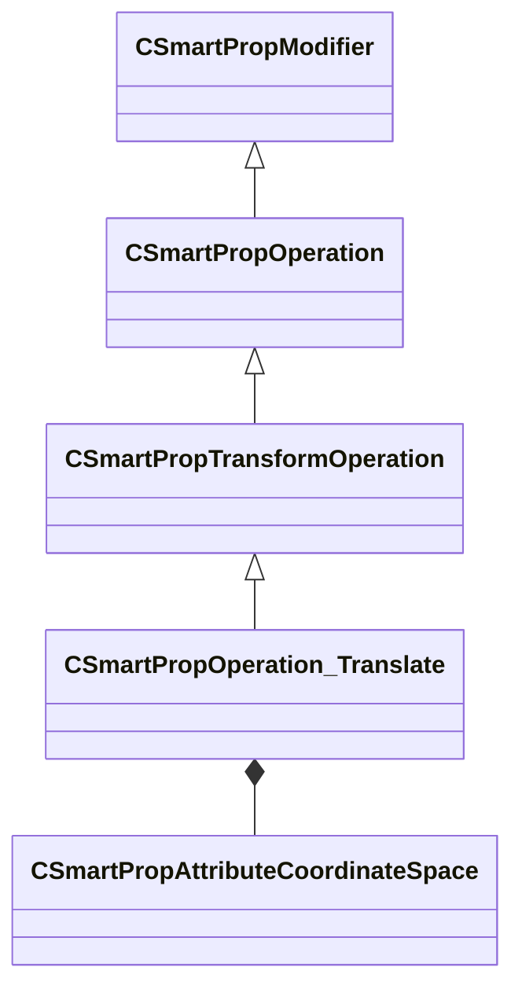

[Schemas](../../schemas.md) / [smartprops](../smartprops.md) / CSmartPropOperation_Translate

# CSmartPropOperation_Translate

> Source: **Build 25000182** · 2026-08-28 · `windows-x86_64` · schema `0.10.0`

**Kind:** class · **Size:** 208 bytes (`0xd0`) · **Align:** 8 · **Module:** smartprops

**Inherits from:** [CSmartPropTransformOperation](../smartprops/CSmartPropTransformOperation.md)

**Metadata:** `MPropertyDescription Apply a position offset to the current transform.`, `MPropertyFriendlyName Transform: Translate`, `MVDataClassGroup Transform`

**Relationships:**

## Memory layout

3 fields (2 declared here, 1 inherited). Offsets are absolute from the object base.

| Offset | Field | Type | From | Annotations |
|--------|-------|------|------|-------------|
| `0x8` | `m_bEnabled` | CSmartPropAttributeBool | [CSmartPropModifier](../smartprops/CSmartPropModifier.md) | `MVDataEnableKey` |
| `0x50` | `m_vPosition` | CSmartPropAttributeVector |  | `MPropertyDescription Local space position translation to apply to the current transform` |
| `0x90` | `m_CoordinateSpace` | [CSmartPropAttributeCoordinateSpace](../smartprops/CSmartPropAttributeCoordinateSpace.md) |  | `MPropertyDescription Specifies the coordinate space of the specified position value.` |

KV3 class defaults

<pre>{
	&quot;_class&quot;: &quot;CSmartPropOperation_Translate&quot;,
	&quot;m_bEnabled&quot;: true,
	&quot;m_vPosition&quot;:
	[
		0.000000,
		0.000000,
		0.000000
	],
	&quot;m_CoordinateSpace&quot;: &quot;ELEMENT&quot;
}</pre>

