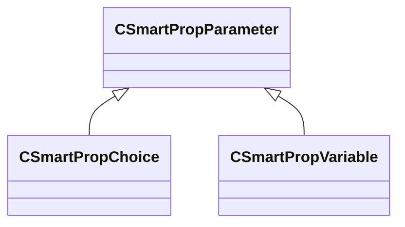

[Schemas](../../schemas.md) / [smartprops](../smartprops.md) / CSmartPropParameter

# CSmartPropParameter

> Source: **Build 25000182** · 2026-08-28 · `windows-x86_64` · schema `0.10.0`

**Kind:** class · **Size:** 16 bytes (`0x10`) · **Align:** n/a (unspecified) · **Module:** smartprops

**Derived by:** [CSmartPropChoice](../smartprops/CSmartPropChoice.md), [CSmartPropVariable](../smartprops/CSmartPropVariable.md)

**Metadata:** `MVDataAnonymousNode`, `MVDataNodeType 1`, `MVDataRoot`

**Relationships:**

## Memory layout

1 field (1 declared here, 0 inherited). Offsets are absolute from the object base.

| Offset | Field | Type | From | Annotations |
|--------|-------|------|------|-------------|
| `0x8` | `m_nElementID` | int32 |  | `MPropertySuppressField` `MVDataUniqueMonotonicInt _editor/next_element_id` |
