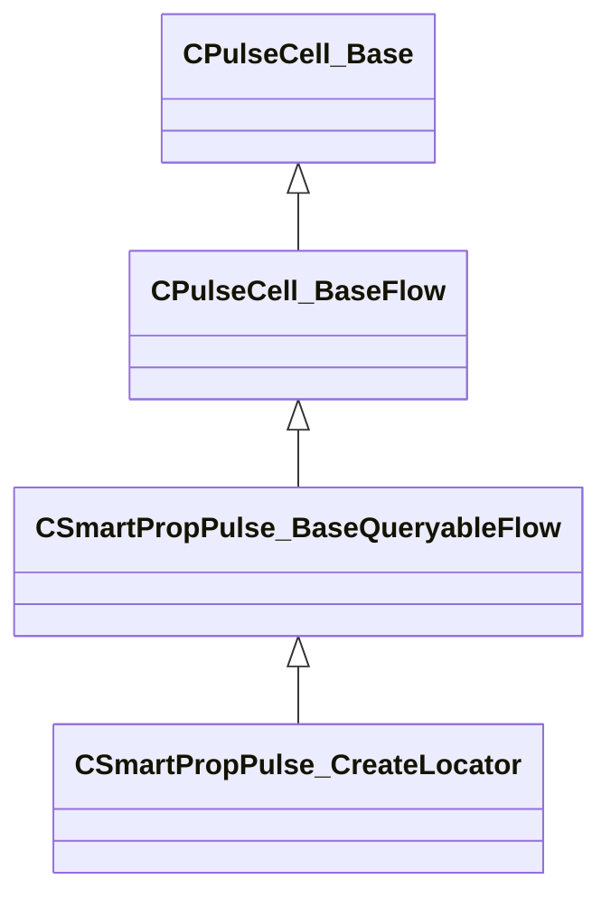

[Schemas](../../schemas.md) / [smartprops](../smartprops.md) / CSmartPropPulse_CreateLocator

# CSmartPropPulse_CreateLocator

> Source: **Build 25000182** · 2026-08-28 · `windows-x86_64` · schema `0.10.0`

**Kind:** class · **Size:** 80 bytes (`0x50`) · **Align:** 8 · **Module:** smartprops

**Inherits from:** [CSmartPropPulse_BaseQueryableFlow](../smartprops/CSmartPropPulse_BaseQueryableFlow.md)

**Metadata:** `MPropertyDescription Create a locator with the current transform. The locator may optionally be configurable, so that its transform can be modified in Hammer.`, `MPropertyFriendlyName Create Locator`, `MVDataClassGroup Manipulators`

**Relationships:**

## Memory layout

2 fields (1 declared here, 1 inherited). Offsets are absolute from the object base.

| Offset | Field | Type | From | Annotations |
|--------|-------|------|------|-------------|
| `0x8` | `m_nEditorNodeID` | [PulseDocNodeID_t](../pulse_runtime_lib/PulseDocNodeID_t.md) | [CPulseCell_Base](../pulse_runtime_lib/CPulseCell_Base.md) | `MFgdFromSchemaCompletelySkipField` |
| `0x48` | `m_LocatorName` | CUtlString |  | `MPropertyDescription Name of the locator. This can be used to reference the locator in this element or its children. If the locator is configurable, the locator will be identified by this name in Hammer.` `MPropertyFriendlyName Name` |

KV3 class defaults

<pre>{
	&quot;_class&quot;: &quot;CSmartPropPulse_CreateLocator&quot;,
	&quot;m_nEditorNodeID&quot;: -1,
	&quot;m_LocatorName&quot;: &quot;&quot;
}</pre>

