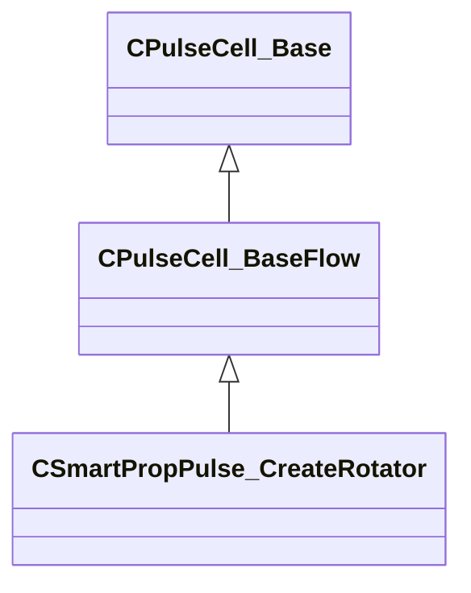

[Schemas](../../schemas.md) / [smartprops](../smartprops.md) / CSmartPropPulse_CreateRotator

# CSmartPropPulse_CreateRotator

**Kind:** class · **Size:** 80 bytes (`0x50`) · **Align:** 8 · **Module:** smartprops

**Inherits from:** [CPulseCell_BaseFlow](../pulse_runtime_lib/CPulseCell_BaseFlow.md)

**Metadata:** `MPropertyDescription Create a rotator that will be displayed at the current location, allowing the user to manipulate a rotation around an axis. The rotation value can be applied to the current transform as well as saved to a variable.`, `MPropertyFriendlyName Create Rotator`, `MVDataClassGroup Manipulators`

**Relationships:**

## Memory layout

2 fields (1 declared here, 1 inherited). Offsets are absolute from the object base.

| Offset | Field | Type | From | Annotations |
|--------|-------|------|------|-------------|
| `0x8` | `m_nEditorNodeID` | [PulseDocNodeID_t](../pulse_runtime_lib/PulseDocNodeID_t.md) | [CPulseCell_Base](../pulse_runtime_lib/CPulseCell_Base.md) | `MFgdFromSchemaCompletelySkipField` |
| `0x48` | `m_Name` | CUtlString |  | `MPropertyDescription Name used to identify the rotator. Must be unique within the parent element.` `MPropertyFriendlyName Name` |

KV3 class defaults

<pre>{
	&quot;_class&quot;: &quot;CSmartPropPulse_CreateRotator&quot;,
	&quot;m_nEditorNodeID&quot;: -1,
	&quot;m_Name&quot;: &quot;&quot;
}</pre>

