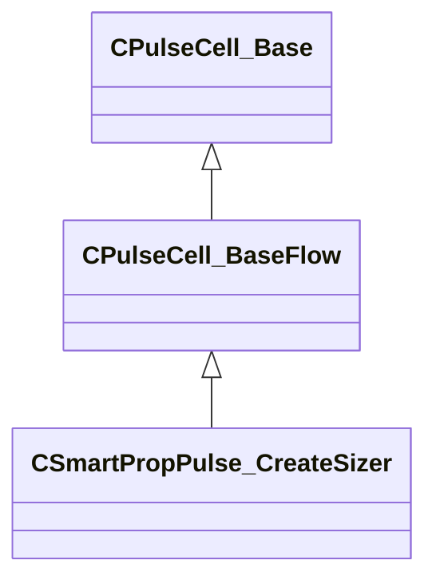

[Schemas](../../schemas.md) / [smartprops](../smartprops.md) / CSmartPropPulse_CreateSizer

# CSmartPropPulse_CreateSizer

> Source: **Build 25000182** · 2026-08-28 · `windows-x86_64` · schema `0.10.0`

**Kind:** class · **Size:** 88 bytes (`0x58`) · **Align:** 8 · **Module:** smartprops

**Inherits from:** [CPulseCell_BaseFlow](../pulse_runtime_lib/CPulseCell_BaseFlow.md)

**Metadata:** `MPropertyDescription Create a sizer that will be displayed at the current location, allowing the user to manipulate the specified set of size values.`, `MPropertyFriendlyName Create Sizer`, `MVDataClassGroup Manipulators`

**Relationships:**

## Memory layout

8 fields (7 declared here, 1 inherited). Offsets are absolute from the object base.

| Offset | Field | Type | From | Annotations |
|--------|-------|------|------|-------------|
| `0x8` | `m_nEditorNodeID` | [PulseDocNodeID_t](../pulse_runtime_lib/PulseDocNodeID_t.md) | [CPulseCell_Base](../pulse_runtime_lib/CPulseCell_Base.md) | `MFgdFromSchemaCompletelySkipField` |
| `0x48` | `m_Name` | CUtlString |  | `MPropertyDescription Name used to identify the sizer. Must be unique within the paraent element.` `MPropertyFriendlyName Name` |
| `0x50` | `m_bHACK_ProvideResultMinX` | bool |  |  |
| `0x51` | `m_bHACK_ProvideResultMaxX` | bool |  |  |
| `0x52` | `m_bHACK_ProvideResultMinY` | bool |  |  |
| `0x53` | `m_bHACK_ProvideResultMaxY` | bool |  |  |
| `0x54` | `m_bHACK_ProvideResultMinZ` | bool |  |  |
| `0x55` | `m_bHACK_ProvideResultMaxZ` | bool |  |  |

KV3 class defaults

<pre>{
	&quot;_class&quot;: &quot;CSmartPropPulse_CreateSizer&quot;,
	&quot;m_nEditorNodeID&quot;: -1,
	&quot;m_Name&quot;: &quot;&quot;,
	&quot;m_bHACK_ProvideResultMinX&quot;: false,
	&quot;m_bHACK_ProvideResultMaxX&quot;: false,
	&quot;m_bHACK_ProvideResultMinY&quot;: false,
	&quot;m_bHACK_ProvideResultMaxY&quot;: false,
	&quot;m_bHACK_ProvideResultMinZ&quot;: false,
	&quot;m_bHACK_ProvideResultMaxZ&quot;: false
}</pre>

