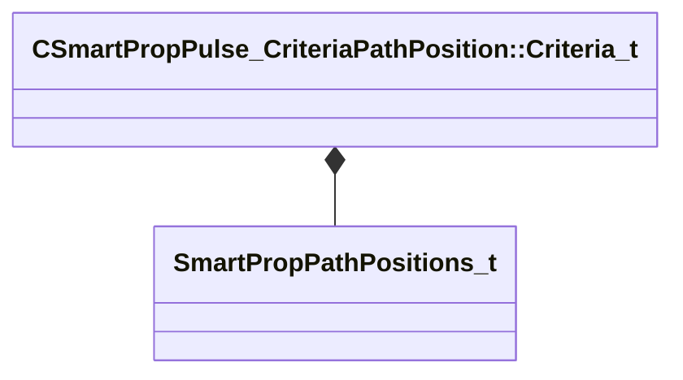

[Schemas](../../schemas.md) / [smartprops](../smartprops.md) / CSmartPropPulse_CriteriaPathPosition::Criteria_t

# CSmartPropPulse_CriteriaPathPosition::Criteria_t

> Source: **Build 25000182** · 2026-08-28 · `windows-x86_64` · schema `0.10.0`

**Kind:** class · **Size:** 16 bytes (`0x10`) · **Align:** n/a (unspecified) · **Module:** smartprops

**Relationships:**

## Memory layout

5 fields (5 declared here, 0 inherited). Offsets are absolute from the object base.

| Offset | Field | Type | From | Annotations |
|--------|-------|------|------|-------------|
| `0x0` | `m_PlaceAtPositions` | [SmartPropPathPositions_t](../smartprops/SmartPropPathPositions_t.md) |  | `MPropertyDescription Specifies the method to use to determine which positions this element should be placed at along the path.` |
| `0x4` | `m_nPlaceEveryNthPosition` | int32 |  | `MPropertyDescription Specifies the spacing between positions. For example, a value of 1 will place the element at very position, 2 every other position, 3 every third position` `MPropertySuppressExpr ( m_PlaceAtPositions == ALL ) &#124;&#124; ( m_PlaceAtPositions == START_AND_END ) &#124;&#124; ( m_PlaceAtPositions == CONTROL_POINTS )` |
| `0x8` | `m_nNthPositionIndexOffset` | int32 |  | `MPropertyDescription Specifies an offset to use when determining the Nth position to place an element at. For example if placing at every third position with an offset of 0, an element will appear at positions 1, 4, 7, and so on. But if an offset of 2 is set instead of 0, then an element will appear at positions 3, 6, and 9 and so on.` `MPropertySuppressExpr ( m_PlaceAtPositions == ALL ) &#124;&#124; ( m_PlaceAtPositions == START_AND_END ) &#124;&#124; ( m_PlaceAtPositions == CONTROL_POINTS )` |
| `0xc` | `m_bAllowAtStart` | bool |  | `MPropertyDescription Should this element be placed at the first positions on the path` |
| `0xd` | `m_bAllowAtEnd` | bool |  | `MPropertyDescription Should this element be placed at the last positions on the path` |
