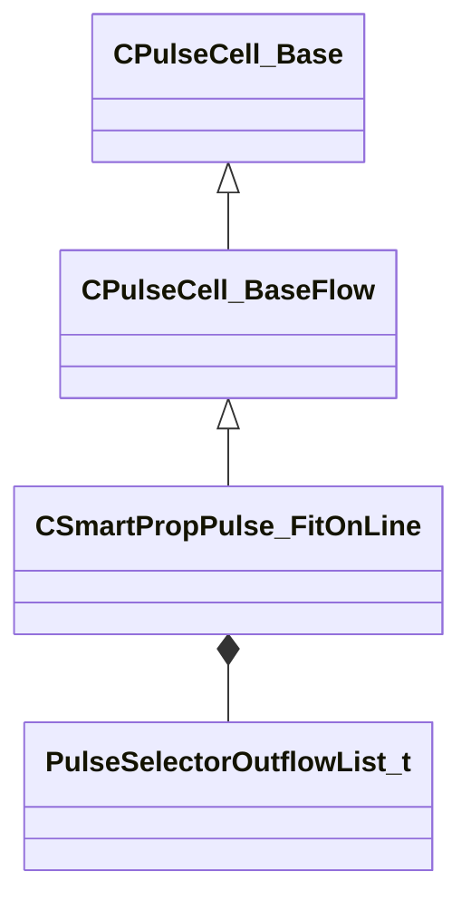

[Schemas](../../schemas.md) / [smartprops](../smartprops.md) / CSmartPropPulse_FitOnLine

# CSmartPropPulse_FitOnLine

**Kind:** class · **Size:** 96 bytes (`0x60`) · **Align:** 8 · **Module:** smartprops

**Inherits from:** [CPulseCell_BaseFlow](../pulse_runtime_lib/CPulseCell_BaseFlow.md)

**Metadata:** `MPropertyDescription An element which fits one or more instances of a set of choices on to a line.`, `MPropertyFriendlyName Fit on Line`, `MPulseEditorCanvasItemSpecKV3 { className='IsControlFlowNode AllOutflowsInSpecialSection IsSelectorNode' create_special_outflows_section=true }`, `MPulseEditorHeaderIcon tools/images/pulse_editor/requirements.png`

**Relationships:**

## Memory layout

2 fields (1 declared here, 1 inherited). Offsets are absolute from the object base.

| Offset | Field | Type | From | Annotations |
|--------|-------|------|------|-------------|
| `0x8` | `m_nEditorNodeID` | [PulseDocNodeID_t](../pulse_runtime_lib/PulseDocNodeID_t.md) | [CPulseCell_Base](../pulse_runtime_lib/CPulseCell_Base.md) | `MFgdFromSchemaCompletelySkipField` |
| `0x48` | `m_OutflowList` | [PulseSelectorOutflowList_t](../pulse_runtime_lib/PulseSelectorOutflowList_t.md) |  |  |

KV3 class defaults

<pre>{
	&quot;_class&quot;: &quot;CSmartPropPulse_FitOnLine&quot;,
	&quot;m_nEditorNodeID&quot;: -1,
	&quot;m_OutflowList&quot;:
	{
		&quot;m_Outflows&quot;:
		[
		]
	}
}</pre>

