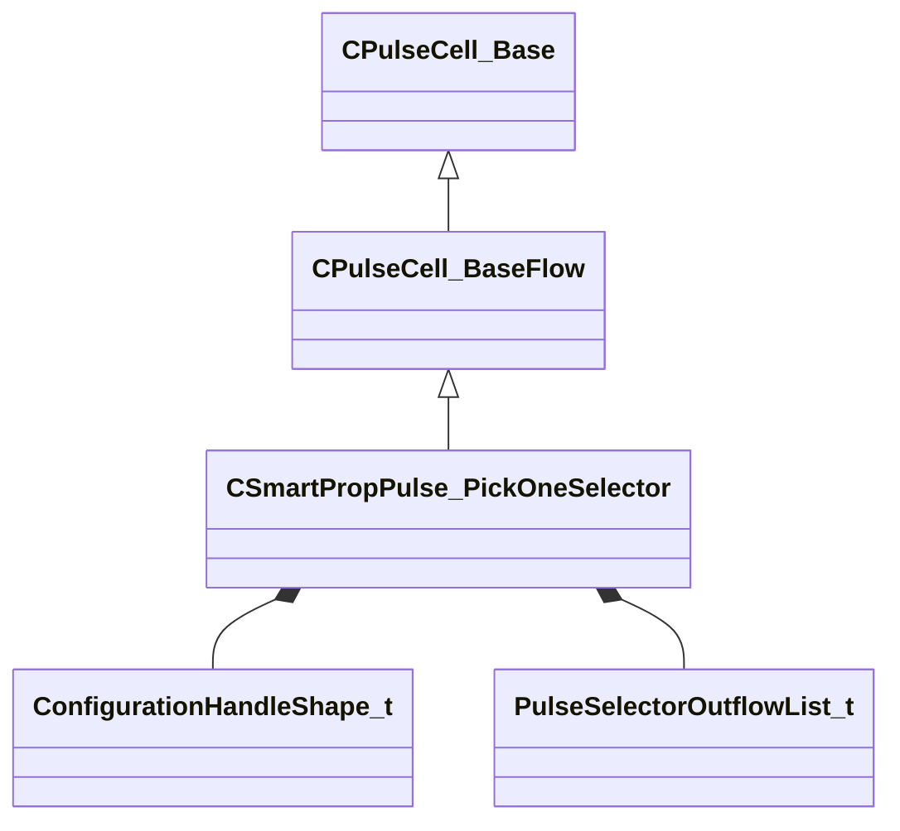

[Schemas](../../schemas.md) / [smartprops](../smartprops.md) / CSmartPropPulse_PickOneSelector

# CSmartPropPulse_PickOneSelector

> Source: **Build 25000182** · 2026-08-28 · `windows-x86_64` · schema `0.10.0`

**Kind:** class · **Size:** 104 bytes (`0x68`) · **Align:** 8 · **Module:** smartprops

**Inherits from:** [CPulseCell_BaseFlow](../pulse_runtime_lib/CPulseCell_BaseFlow.md)

**Metadata:** `MPropertyDescription An element which selects a single choice from its set of child choices.`, `MPropertyFriendlyName Select Single Child`, `MPulseEditorCanvasItemSpecKV3 { className='IsControlFlowNode AllOutflowsInSpecialSection IsSelectorNode' create_special_outflows_section=true }`, `MPulseEditorHeaderIcon tools/images/pulse_editor/requirements.png`

**Relationships:**

## Memory layout

3 fields (2 declared here, 1 inherited). Offsets are absolute from the object base.

| Offset | Field | Type | From | Annotations |
|--------|-------|------|------|-------------|
| `0x8` | `m_nEditorNodeID` | [PulseDocNodeID_t](../pulse_runtime_lib/PulseDocNodeID_t.md) | [CPulseCell_Base](../pulse_runtime_lib/CPulseCell_Base.md) | `MFgdFromSchemaCompletelySkipField` |
| `0x48` | `m_HandleShape` | [ConfigurationHandleShape_t](../smartprops/ConfigurationHandleShape_t.md) |  | `MPropertyDescription Shape of the configuration handle to display.` `MPropertyGroupName Handle Settings` `MPropertyReadonlyExpr bConfigurable == false` |
| `0x50` | `m_OutflowList` | [PulseSelectorOutflowList_t](../pulse_runtime_lib/PulseSelectorOutflowList_t.md) |  |  |

KV3 class defaults

<pre>{
	&quot;_class&quot;: &quot;CSmartPropPulse_PickOneSelector&quot;,
	&quot;m_nEditorNodeID&quot;: -1,
	&quot;m_HandleShape&quot;: &quot;SQUARE&quot;,
	&quot;m_OutflowList&quot;:
	{
		&quot;m_Outflows&quot;:
		[
		]
	}
}</pre>

