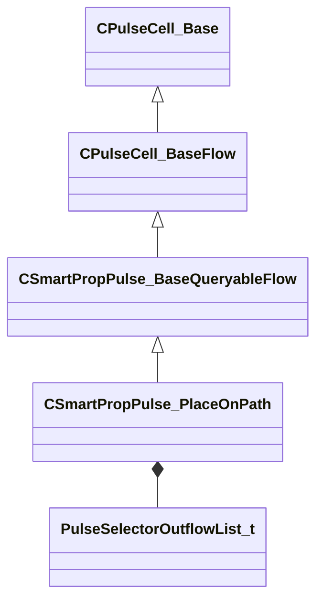

[Schemas](../../schemas.md) / [smartprops](../smartprops.md) / CSmartPropPulse_PlaceOnPath

# CSmartPropPulse_PlaceOnPath

> Source: **Build 25000182** · 2026-08-28 · `windows-x86_64` · schema `0.10.0`

**Kind:** class · **Size:** 104 bytes (`0x68`) · **Align:** 8 · **Module:** smartprops

**Inherits from:** [CSmartPropPulse_BaseQueryableFlow](../smartprops/CSmartPropPulse_BaseQueryableFlow.md)

**Metadata:** `MPropertyFriendlyName Place On Path`, `MPulseEditorCanvasItemSpecKV3 { className='IsControlFlowNode AllOutflowsInSpecialSection IsSelectorNode' create_special_outflows_section=true }`, `MPulseEditorHeaderIcon tools/images/pulse_editor/requirements.png`

**Relationships:**

## Memory layout

3 fields (2 declared here, 1 inherited). Offsets are absolute from the object base.

| Offset | Field | Type | From | Annotations |
|--------|-------|------|------|-------------|
| `0x8` | `m_nEditorNodeID` | [PulseDocNodeID_t](../pulse_runtime_lib/PulseDocNodeID_t.md) | [CPulseCell_Base](../pulse_runtime_lib/CPulseCell_Base.md) | `MFgdFromSchemaCompletelySkipField` |
| `0x48` | `m_OutflowList` | [PulseSelectorOutflowList_t](../pulse_runtime_lib/PulseSelectorOutflowList_t.md) |  |  |
| `0x60` | `m_PathName` | CUtlString |  | `MPropertyDescription Name of the path to use. This path name will show up in the property editor when selecting a placement of this smart prop in Hammer, allowing selection of a path object in the map to use.` |

KV3 class defaults

<pre>{
	&quot;_class&quot;: &quot;CSmartPropPulse_PlaceOnPath&quot;,
	&quot;m_nEditorNodeID&quot;: -1,
	&quot;m_OutflowList&quot;:
	{
		&quot;m_Outflows&quot;:
		[
		]
	},
	&quot;m_PathName&quot;: &quot;&quot;
}</pre>

