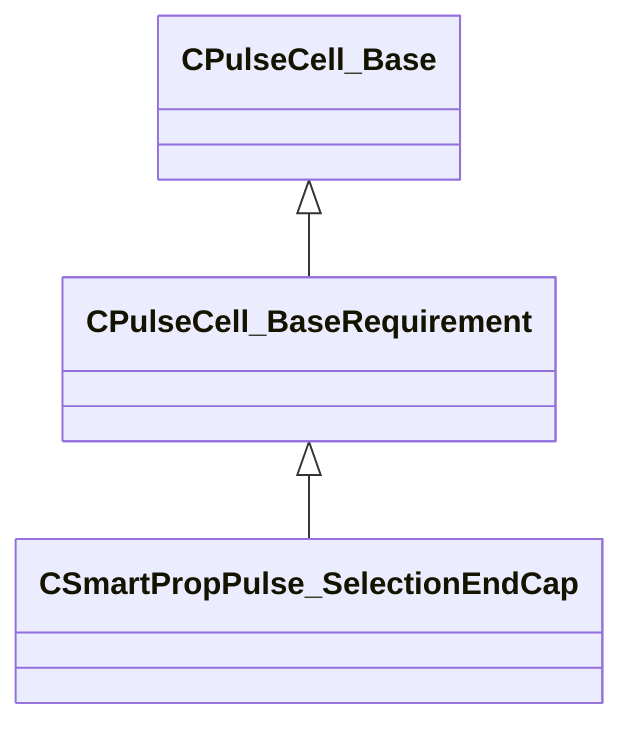

[Schemas](../../schemas.md) / [smartprops](../smartprops.md) / CSmartPropPulse_SelectionEndCap

# CSmartPropPulse_SelectionEndCap

**Kind:** class · **Size:** 72 bytes (`0x48`) · **Align:** 8 · **Module:** smartprops

**Inherits from:** [CPulseCell_BaseRequirement](../pulse_runtime_lib/CPulseCell_BaseRequirement.md)

**Metadata:** `MPropertyDescription Specifies that this is a special part that should be used at the start or end of the line.`, `MPropertyFriendlyName End Cap Settings`

**Relationships:**

## Memory layout

1 fields (0 declared here, 1 inherited). Offsets are absolute from the object base.

| Offset | Field | Type | From | Annotations |
|--------|-------|------|------|-------------|
| `0x8` | `m_nEditorNodeID` | [PulseDocNodeID_t](../pulse_runtime_lib/PulseDocNodeID_t.md) | [CPulseCell_Base](../pulse_runtime_lib/CPulseCell_Base.md) | `MFgdFromSchemaCompletelySkipField` |

KV3 class defaults

<pre>{
	&quot;_class&quot;: &quot;CSmartPropPulse_SelectionEndCap&quot;,
	&quot;m_nEditorNodeID&quot;: -1
}</pre>

