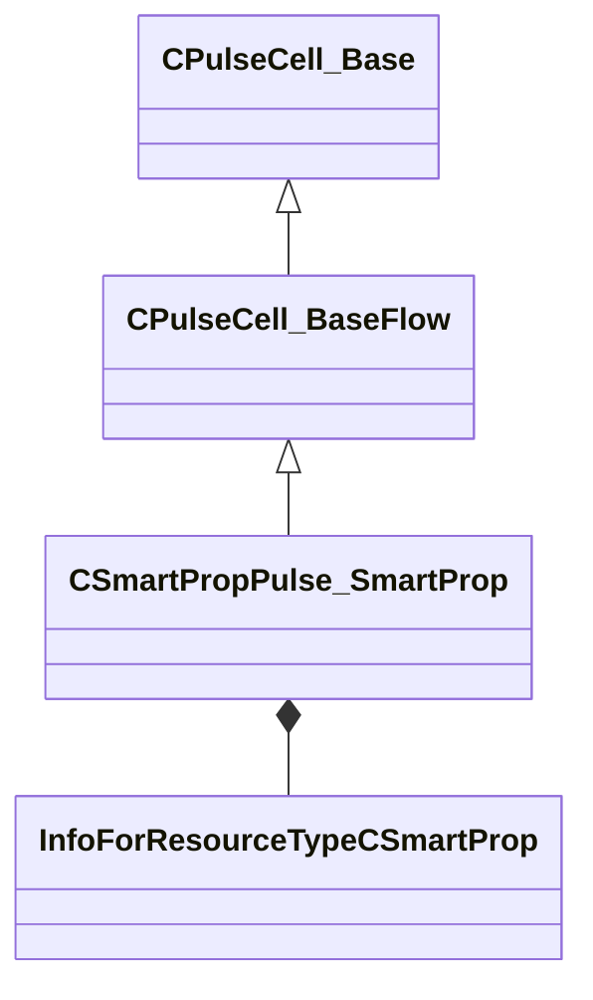

[Schemas](../../schemas.md) / [smartprops](../smartprops.md) / CSmartPropPulse_SmartProp

# CSmartPropPulse_SmartProp

> Source: **Build 25000182** · 2026-08-28 · `windows-x86_64` · schema `0.10.0`

**Kind:** class · **Size:** 80 bytes (`0x50`) · **Align:** 8 · **Module:** smartprops

**Inherits from:** [CPulseCell_BaseFlow](../pulse_runtime_lib/CPulseCell_BaseFlow.md)

**Metadata:** `MPropertyFriendlyName Smart Prop Reference`

**Relationships:**

## Memory layout

2 fields (1 declared here, 1 inherited). Offsets are absolute from the object base.

| Offset | Field | Type | From | Annotations |
|--------|-------|------|------|-------------|
| `0x8` | `m_nEditorNodeID` | [PulseDocNodeID_t](../pulse_runtime_lib/PulseDocNodeID_t.md) | [CPulseCell_Base](../pulse_runtime_lib/CPulseCell_Base.md) | `MFgdFromSchemaCompletelySkipField` |
| `0x48` | `m_hSmartProp` | CStrongHandle< [InfoForResourceTypeCSmartProp](../resourcesystem/InfoForResourceTypeCSmartProp.md) > |  | `MPropertyDescription Name of the target smart prop resource (.vsmart) to evaluate.` |

KV3 class defaults

<pre>{
	&quot;_class&quot;: &quot;CSmartPropPulse_SmartProp&quot;,
	&quot;m_nEditorNodeID&quot;: -1,
	&quot;m_hSmartProp&quot;: &quot;&quot;
}</pre>

