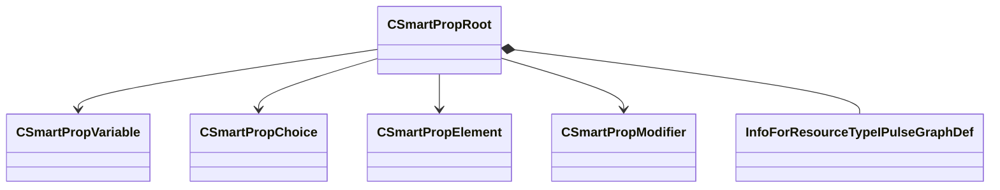

[Schemas](../../schemas.md) / [smartprops](../smartprops.md) / CSmartPropRoot

# CSmartPropRoot

> Source: **Build 25000182** · 2026-08-28 · `windows-x86_64` · schema `0.10.0`

**Kind:** class · **Size:** 208 bytes (`0xd0`) · **Align:** 8 · **Module:** smartprops

**Metadata:** `MPropertyDescription Root of a smart prop, contains a list of elements to evaluate.`, `MPropertyFriendlyName Smart Prop Root`, `MSmartPropClassVersion 0`, `MVDataFileExtension vsmart`, `MVDataGroupNodeClass`, `MVDataPreviewWidget smart_prop`, `MVDataRoot`, `MVDataSingleton`, `MVDataUsesComponentEditor`

**Relationships:**

## Memory layout

7 fields (7 declared here, 0 inherited). Offsets are absolute from the object base.

| Offset | Field | Type | From | Annotations |
|--------|-------|------|------|-------------|
| `0x0` | `m_nContentVersion` | int32 |  | `MPropertyDescription Specifies the current version of this smart prop. Any existing references to this smart prop with an older version number will not automatically update.` |
| `0x8` | `m_nMaxDepth` | CSmartPropAttributeInt |  | `MPropertyDescription Maximum depth of smart prop evaluation stack during evaluation.` |
| `0x48` | `m_Variables` | CUtlVector< [CSmartPropVariable](../smartprops/CSmartPropVariable.md)* > |  | `MPropertyFriendlyName Variables` `MVDataPromoteField 2` |
| `0x60` | `m_Choices` | CUtlVector< [CSmartPropChoice](../smartprops/CSmartPropChoice.md)* > |  | `MPropertyFriendlyName Choices` `MVDataPromoteField 2` |
| `0x78` | `m_Children` | CUtlVector< [CSmartPropElement](../smartprops/CSmartPropElement.md)* > |  | `MPropertyDescription List of the root level elements making up the smart prop definition, each element may be an entire tree.` `MVDataPromoteField 1` |
| `0x90` | `m_Modifiers` | CUtlVector< [CSmartPropModifier](../smartprops/CSmartPropModifier.md)* > |  | `MPropertyFriendlyName Modifiers` `MVDataPromoteField 2` |
| `0xa8` | `m_hPulseGraph` | CStrongHandle< [InfoForResourceTypeIPulseGraphDef](../resourcesystem/InfoForResourceTypeIPulseGraphDef.md) > |  | `MPropertySuppressExpr !__IsSmartPropPulseActive` |

KV3 class defaults

<pre>{
	&quot;m_nContentVersion&quot;: 0,
	&quot;m_nMaxDepth&quot;: 32,
	&quot;m_Variables&quot;:
	[
	],
	&quot;m_Choices&quot;:
	[
	],
	&quot;m_Children&quot;:
	[
	],
	&quot;m_Modifiers&quot;:
	[
	],
	&quot;m_hPulseGraph&quot;: &quot;&quot;
}</pre>

