[Schemas](../../schemas.md) / [smartprops](../smartprops.md) / CSmartPropSelectionCriteria

# CSmartPropSelectionCriteria

**Kind:** class · **Size:** 72 bytes (`0x48`) · **Align:** 255 · **Module:** smartprops

**Derived by:** [CSmartPropSelectionCriteria_ChoiceWeight](../smartprops/CSmartPropSelectionCriteria_ChoiceWeight.md), [CSmartPropSelectionCriteria_EdgeAngleCriteria](../smartprops/CSmartPropSelectionCriteria_EdgeAngleCriteria.md), [CSmartPropSelectionCriteria_EndCap](../smartprops/CSmartPropSelectionCriteria_EndCap.md), [CSmartPropSelectionCriteria_IsValid](../smartprops/CSmartPropSelectionCriteria_IsValid.md), [CSmartPropSelectionCriteria_LinearLength](../smartprops/CSmartPropSelectionCriteria_LinearLength.md), [CSmartPropSelectionCriteria_MaterialCriteria](../smartprops/CSmartPropSelectionCriteria_MaterialCriteria.md), [CSmartPropSelectionCriteria_PathPosition](../smartprops/CSmartPropSelectionCriteria_PathPosition.md), [CSmartPropSelectionCriteria_TopoEdgeCountCriteria](../smartprops/CSmartPropSelectionCriteria_TopoEdgeCountCriteria.md), [CSmartPropSelectionCriteria_VertexCountCriteria](../smartprops/CSmartPropSelectionCriteria_VertexCountCriteria.md)

**Metadata:** `MVDataAnonymousNode`, `MVDataBase`, `MVDataNodeType 1`

**Relationships:**

```mermaid
classDiagram
    CSmartPropSelectionCriteria <|-- CSmartPropSelectionCriteria_ChoiceWeight
    CSmartPropSelectionCriteria <|-- CSmartPropSelectionCriteria_EdgeAngleCriteria
    CSmartPropSelectionCriteria <|-- CSmartPropSelectionCriteria_EndCap
    CSmartPropSelectionCriteria <|-- CSmartPropSelectionCriteria_IsValid
    CSmartPropSelectionCriteria <|-- CSmartPropSelectionCriteria_LinearLength
    CSmartPropSelectionCriteria <|-- CSmartPropSelectionCriteria_MaterialCriteria
    CSmartPropSelectionCriteria <|-- CSmartPropSelectionCriteria_PathPosition
    CSmartPropSelectionCriteria <|-- CSmartPropSelectionCriteria_TopoEdgeCountCriteria
    CSmartPropSelectionCriteria <|-- CSmartPropSelectionCriteria_VertexCountCriteria
```

## Memory layout

1 fields (1 declared here, 0 inherited). Offsets are absolute from the object base.

| Offset | Field | Type | From | Annotations |
|--------|-------|------|------|-------------|
| `0x8` | `m_bEnabled` | CSmartPropAttributeBool |  | `MVDataEnableKey` |
