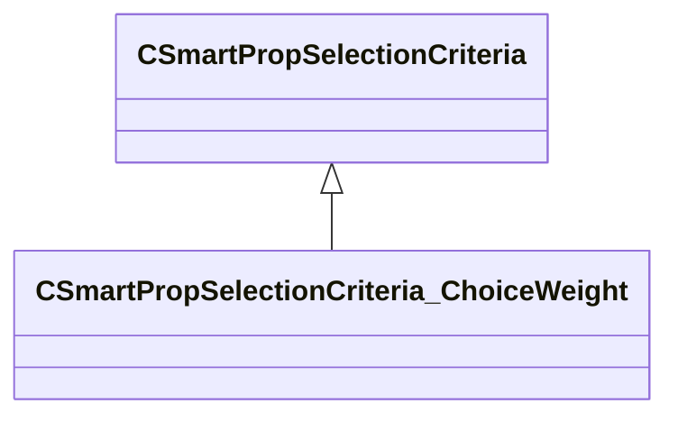

[Schemas](../../schemas.md) / [smartprops](../smartprops.md) / CSmartPropSelectionCriteria_ChoiceWeight

# CSmartPropSelectionCriteria_ChoiceWeight

> Source: **Build 25000182** · 2026-08-28 · `windows-x86_64` · schema `0.10.0`

**Kind:** class · **Size:** 136 bytes (`0x88`) · **Align:** 8 · **Module:** smartprops

**Inherits from:** [CSmartPropSelectionCriteria](../smartprops/CSmartPropSelectionCriteria.md)

**Metadata:** `MPropertyDescription Specifies a weighting value which affects that likelyhood of selecting this element which picking a choice.`, `MPropertyFriendlyName Choice Weight`, `MVDataComponentValidGrandParents`

**Relationships:**

## Memory layout

2 fields (1 declared here, 1 inherited). Offsets are absolute from the object base.

| Offset | Field | Type | From | Annotations |
|--------|-------|------|------|-------------|
| `0x8` | `m_bEnabled` | CSmartPropAttributeBool | [CSmartPropSelectionCriteria](../smartprops/CSmartPropSelectionCriteria.md) | `MVDataEnableKey` |
| `0x48` | `m_flWeight` | CSmartPropAttributeFloat |  | `MPropertyDescription Relative weight of this choice, higher weighted choices are more likely to be selected.` |

KV3 class defaults

<pre>{
	&quot;_class&quot;: &quot;CSmartPropSelectionCriteria_ChoiceWeight&quot;,
	&quot;m_bEnabled&quot;: true,
	&quot;m_flWeight&quot;: 1.000000
}</pre>

